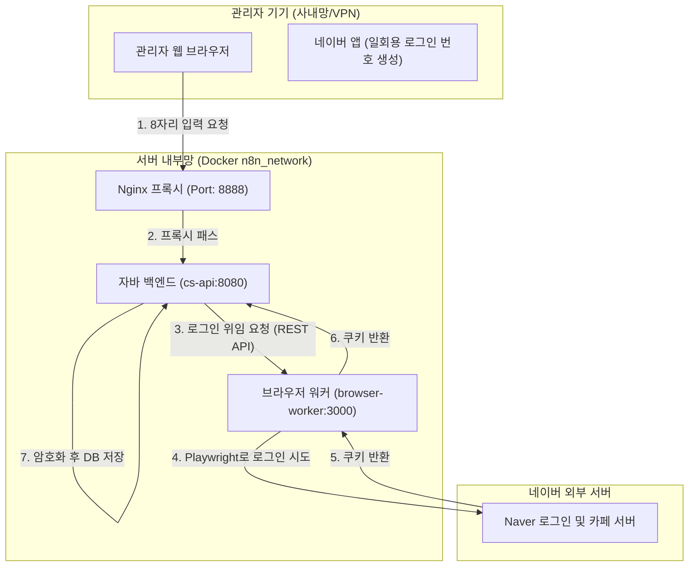
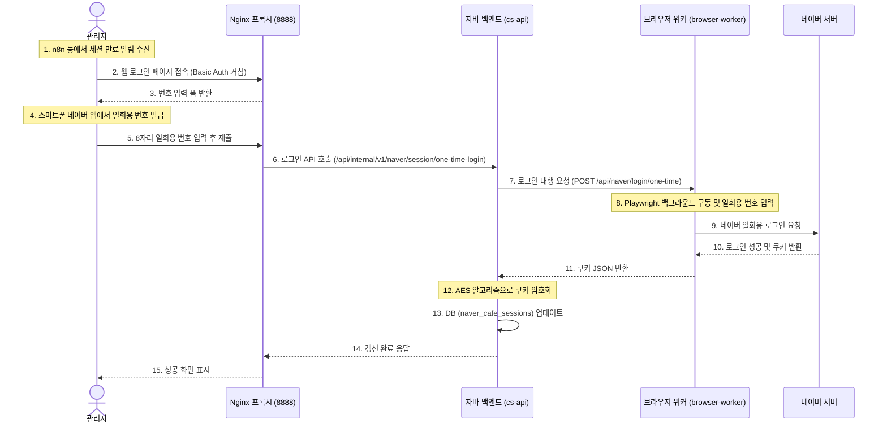

# 네이버 세션 자동화 및 갱신 아키텍처 가이드 (NAVER Session Automation)

이 문서에서는 Redis와 ngrok을 제거하고 사내망(LAN/VPN) 환경에서 스프링 백엔드와 Node.js 워커 컨테이너 간의 **직접 HTTP 통신**을 기반으로 구축된 네이버 비공개 카페 세션 자동화 및 갱신 시스템을 설명합니다.

---

## 1. 아키텍처 개요 (Architecture Overview)

전체 시스템은 보안 및 외부망 폐쇄성을 고려하여 사내망(LAN/VPN) 내부에서 직접적으로 HTTP 통신을 수행하도록 설계되었습니다.



---

## 2. 세션 갱신 시퀀스 (Interaction Flow)

스마트폰 네이버 앱에서 발급된 8자리 일회용 코드가 어떻게 백엔드 DB의 세션 쿠키로 갱신되는지 보여주는 흐름입니다.



---

## 3. 컴포넌트별 구현 역할 및 파일 맵

### ① 브라우저 워커 (`browser-worker/`)
Playwright와 Chromium 브라우저를 이미지 빌드 시 내장 패키징하여, 런타임에 외부 인터넷 접속(바이너리 다운로드) 없이도 완전한 폐쇄망 동작을 지원합니다.
* **[Dockerfile](file:///c:/Users/RUNDAY/Desktop/test-bed/browser-worker/Dockerfile)**: Playwright 공식 이미지를 기반으로 빌드 환경 설정.
* **[src/browser.js](file:///c:/Users/RUNDAY/Desktop/test-bed/browser-worker/src/browser.js)**: Stealth 우회 플러그인 설정 및 모바일 User-Agent 모킹 공통 함수.
* **[src/tasks/naverCafe.js](file:///c:/Users/RUNDAY/Desktop/test-bed/browser-worker/src/tasks/naverCafe.js)**:
  * `oneTimeLogin(code)`: 일회용 로그인 코드를 입력하여 로그인한 뒤 쿠키(`NID_AUT` 등)를 JSON 형태로 파싱하여 반환.
  * `postComment(taskData)`: 쿠키를 주입한 모바일 웹 브라우저에서 댓글/답글 작성을 대행.
  * `validateSession(cookies)`: 네이버 카페 모바일 메인에 접속해 로그인 유도 여부를 확인하여 세션 유효성을 판별.
* **[server.js](file:///c:/Users/RUNDAY/Desktop/test-bed/browser-worker/server.js)**: Express 기반 API 서버로, 백엔드가 호출할 수 있는 `POST /api/naver/login/one-time`, `POST /api/naver/comment`, `POST /api/naver/session/validate` 엔드포인트를 노출하고 토큰 검증 수행.

### ② 자바 백엔드 (`backend/`)
* **[build.gradle.kts](file:///c:/Users/RUNDAY/Desktop/test-bed/backend/build.gradle.kts)**: Redis 의존성 제거.
* **[NaverSessionService.java](file:///c:/Users/RUNDAY/Desktop/test-bed/backend/src/main/java/com/ttam/cs/feature/auth/service/NaverSessionService.java)**:
  * `saveSession(id, encrypted)`: 세션을 데이터베이스에 영속화.
  * `renewSessionWithOneTimeCode(id, code)`: Extended Timeout(20초)이 설정된 `RestClient`를 통해 워커에 일회용 번호 로그인을 위임하고 반환받은 쿠키를 암호화하여 저장.
  * `syncSessionStatus(id)`: 저장된 쿠키 유효성을 워커 호출을 통해 실시간 검증하고 결과를 DB 상태(status)와 동기화.
* **[NaverSessionController.java](file:///c:/Users/RUNDAY/Desktop/test-bed/backend/src/main/java/com/ttam/cs/feature/auth/api/NaverSessionController.java)**:
  * `GET /api/internal/v1/naver/session`: n8n 등 내부 연동 시스템을 위한 세션 조회 API. **보안을 위해 쿠키 정보는 응답 바디(JSON)에서 제외**하고, 응답 헤더(`Set-Cookie` 및 단일 문자열 포맷인 `X-Naver-Cookie`)로 반환합니다.
  * `POST /api/internal/v1/naver/session/one-time-login`: 세션 일회용 로그인 갱신.
  * `POST /api/internal/v1/naver/session/sync`: 세션 상태 실시간 강제 검사 및 동기화.
  * `GET /api/internal/v1/naver/session/status`: 복호화 정보 제외, 외부 비노출 세션 상태(status) 및 갱신 시간 조회.

### ③ 프론트엔드 (`frontend/`)
* **[inquiryApi.ts](file:///c:/Users/RUNDAY/Desktop/test-bed/frontend/src/api/inquiryApi.ts)**: 백엔드의 세션 갱신 API(`renewNaverSession`), 상태 조회 API(`getNaverSessionStatus`), 상태 검증 API(`validateNaverSession`) 연동.
* **[NaverLoginRenewPage.tsx](file:///c:/Users/RUNDAY/Desktop/test-bed/frontend/src/components/NaverLoginRenewPage.tsx)**: 스마트폰 네이버 앱의 일회용 번호 발급 경로 가이드를 제공하고 숫자를 입력받아 서버에 요청하는 반응형 유리 효과(Glassmorphism) UI.
* **[App.tsx](file:///c:/Users/RUNDAY/Desktop/test-bed/frontend/src/App.tsx)**: 
  * 브라우저 주소창 경로가 `/naver-login`일 때 갱신 화면을 렌더링하는 라우팅 바인딩.
  * Admin CS 통합뷰 상단 헤더에 네이버 세션 유효성 상태 배너(`renderNaverSessionWidget()`) 배치 및 실시간 확인/갱신 연동.

---

## 3. 보안 개선 사항 (Security Enhancements)

n8n과 같은 외부 연동 워크플로우 엔진에서 복호화된 네이버 세션 쿠키를 읽어 네이버 API를 대리 호출할 때, 호출 로그(Response Body/JSON logs)에 민감한 세션 쿠키 평문 정보가 그대로 기록되거나 노출되는 보안 위협을 원천 방어하고자 아래와 같이 응답 처리 구조를 대폭 개선했습니다.

1. **JSON Response Body 제거**:
   * `GET /api/internal/v1/naver/session` API의 응답 JSON 바디에서 `cookiesJson` 필드를 완전히 제거했습니다.
   * 이제 응답 바디에는 오직 세션 기본 식별 정보(`id`), 상태(`status`), 갱신 시점(`updatedAt`)만 담겨 반환됩니다.
2. **응답 HTTP 헤더를 통한 쿠키 전송**:
   * 복호화된 개별 쿠키들은 표준 스펙에 맞게 HTTP 응답의 `Set-Cookie` 헤더로 분리되어 전송됩니다.
   * 연동의 편의성을 극대화하기 위해, n8n 등의 HTTP Request 노드에서 복호화된 전체 쿠키의 합본을 별도의 파싱 로직 없이 `Cookie` 요청 헤더에 즉시 주입할 수 있도록 세미콜론(`;`) 구분 기반 문자열 형태의 **`X-Naver-Cookie`** 커스텀 헤더를 추가 제공합니다.

### 검증 결과 (Validation)

내부 컨테이너 통신을 흉내 내어 API 호출을 테스트한 결과는 다음과 같습니다:

* **테스트 요청**: `GET /api/internal/v1/naver/session`
* **응답 헤더 확인**:
  ```http
  Set-Cookie: NID_AUT=eRDOOpHw...; Path=/; Domain=.naver.com; Secure; HttpOnly
  Set-Cookie: NID_SES=AAABz3mT...; Path=/; Domain=.naver.com; Secure; HttpOnly
  X-Naver-Cookie: nid_slevel=1; SRT30=...; NID_AUT=eRDOOpHw...; NID_SES=AAABz3mT...
  ```
* **응답 JSON 바디 확인**:
  ```json
  {
    "id": "default",
    "status": "ACTIVE",
    "updatedAt": "2026-06-23T05:36:00.458543Z"
  }
  ```
  *(쿠키 데이터가 JSON 바디에 전혀 보이지 않고 안전하게 분리되어 전송됨을 검증했습니다.)*

---

## 4. 운영자 가이드 (Session Renewal Manual)

세션 만료 알림을 받았을 때 아래 가이드에 따라 세션을 갱신합니다.

### 1단계: 갱신 페이지 접속
* 사내망/VPN에 연결된 PC나 스마트폰 브라우저에서 아래 주소로 접속합니다.
  * **주소**: `http://<서버-IP>:8888/naver-login`
  * Nginx Basic Auth 로그인 팝업이 뜨면 등록된 사내 관리자용 계정(`runday-cs-admin`) 정보를 입력하여 로그인합니다.

### 2단계: 스마트폰 네이버 앱에서 일회용 번호 발급
1. 본인 스마트폰에서 **네이버 앱**을 실행합니다.
2. 좌측 상단 **메뉴(≡)** 아이콘을 터치합니다.
3. 우측 상단 **설정(톱니바퀴)** 아이콘을 터치합니다.
4. **'로그인 아이디 관리'** 항목을 터치합니다.
5. 로그인된 아이디 목록에서 우측의 **옵션 더보기(세로 점 3개)** 아이콘을 터치합니다.
6. **'일회용 로그인 번호'**를 터치하고 화면에 생성된 **8자리 숫자**를 확인합니다.

### 3단계: 웹페이지에서 등록 완료
* 확인한 8자리 일회용 번호를 갱신 페이지의 입력란에 넣고 **[세션 갱신하기]** 버튼을 클릭합니다.
* 약 5~10초 동안 백그라운드에서 로그인이 수행되며, 완료 메시지가 표시되면 비공개 카페 자동화 세션 갱신이 성공한 것입니다.

---

## 5. 보안 설계 및 예외 처리 (Security & Exceptions)

1. **쿠키 암호화 저장**:
   * 네이버 세션 쿠키 정보는 평문으로 저장되지 않고, 백엔드 서버에서 `EncryptionUtils`를 거쳐 **AES/ECB/PKCS5Padding**으로 암호화되어 DB 테이블(`naver_cafe_sessions`)에 안전하게 보관됩니다.
2. **컨테이너 보안**:
   * Nginx를 거치지 않는 내부 컨테이너간 통신(`cs-api` ➡️ `browser-worker`) 또한 임의 호출을 방지하기 위해 요청 헤더에 `X-Internal-Token` 보안 값을 필수로 검증하도록 제한되어 있습니다.
3. **만료 및 실패 방어**:
   * 입력 도중 일회용 로그인 코드가 만료되면, 로그인 프로세스가 안전하게 실패하고 DB에 어떠한 변형도 가하지 않은 채 화면에 실패 경고창을 표시하고 재시도를 유도합니다.
4. **민감 정보 노출 방지 (Response Header Cookie)**:
   * n8n 등의 워크플로우 엔진에서 복호화된 세션 쿠키를 조회해 쓸 때, n8n 노드의 execution log 등에 평문 쿠키 정보가 JSON 바디 형태로 영구히 남는 문제를 원천 차단하기 위해 **응답 바디(JSON)에서 쿠키를 완전 제외**하였습니다.
   * 복호화된 쿠키 정보는 `Set-Cookie` 헤더 및 세미콜론 구분 포맷 문자열인 `X-Naver-Cookie` 응답 헤더로만 전달되며, n8n에서는 헤더값을 참조하여 Naver HTTP Request를 안전하게 처리할 수 있습니다.

---

## 6. N8N 워크플로우 통합 가이드 (N8N Workflow Integration Guide)

N8N 워크플로우에서 네이버 비공개 카페 게시글을 수집하기 전, **세션의 실시간 유효성(로그인 유지 상태)을 백엔드 API로 사전 검증**하고, 만료되었을 경우 즉시 관리자 슬랙 채널로 갱신 안내 알림을 보내며 수집을 정지시키는 연동 가이드입니다.

### ① 워크플로우 기본 구성 흐름
전체 수집 주기(Cron/Interval)가 실행되면 다음과 같은 흐름으로 노드를 구성합니다:

```text
[네이버 카페글 수집 (트리거)] 
          ⬇️
[네이버 세션 검증 (POST)] 
          ⬇️
[슬랙 알림 판단 (IF 1)] ──(True: 알림 필요)──> [Slack 알림 발송]
          ⬇️ (False: 이미 알림 전송됨 / Cooldown 중)
[세션 유효 판단 (IF 2)] ──(False: 만료됨)──> (수집 프로세스 조용히 종료)
          ⬇️ (True: 유효함)
   [네이버 세션 조회 (GET)]
          ⬇️
     (기존 수집 진행)
```

---

### ② 각 노드별 세부 설정 지침

#### 1. [네이버 세션 상태 동기화] 노드 (HTTP Request)
* **Method**: `POST`
* **URL**: `http://cs-api:8080/api/internal/v1/naver/session/sync`
* **Headers**:
  * `X-Internal-Token`: `<INTERNAL_API_TOKEN>` (기본값: `changeme`)
* **역할**: 백엔드를 통해 실제 네이버 세션 상태를 확인하여 DB와 동기화하고 알림 여부를 반환하도록 지시합니다.
* **응답 형태**:
  ```json
  {
    "id": "default",
    "status": "ACTIVE",
    "updatedAt": "2026-06-24...",
    "valid": true,
    "shouldAlert": false
  }
  ```

#### 2. [슬랙 알림 판단] 노드 (IF Node 1)
* **조건**: Boolean
  * Value 1: `{{ $json.shouldAlert }}`
  * Operation: `Is True`
* **분기 경로**:
  * **True**: `Slack 알림 발송` 노드로 진행하여 관리자에게 세션 갱신을 독촉합니다. (최초 만료 시점 및 이후 3시간마다 리마인드 알림 전송)
  * **False**: `세션 유효 판단` 노드로 연결됩니다.

#### 3. [세션 유효 판단] 노드 (IF Node 2)
* **조건**: Boolean
  * Value 1: `{{ $json.valid }}`
  * Operation: `Is True`
* **분기 경로**:
  * **True**: `네이버 세션 조회` 노드로 진행하여 정상적으로 카페 글을 수집합니다.
  * **False**: 이미 슬랙 알림을 보냈고 리마인드 쿨타임(3시간) 내에 있는 상태이므로, 추가 알림 발송 없이 워크플로우를 조용히 종료시킵니다.

#### 4. [Slack 알림 발송] 노드 (Slack Node)
* **보낼 채널**: 사내 CS 운영/장애 전송용 슬랙 채널
* **보낼 메시지 (Text)**:
  ```text
  🚨 *[Runday CS 시스템 알림]*
  네이버 카페 세션이 만료되었거나 존재하지 않아 게시글 자동 수집이 일시 중단되었습니다.
  아래 갱신 주소에 접속하여 스마트폰 네이버 앱의 일회용 로그인 번호(8자리)를 받아 세션을 재갱신해 주세요.
  
  🔗 *갱신 페이지*: http://<서버-IP>:8888/naver-login
  ```

#### 5. [네이버 세션 조회] 노드 (HTTP Request)
* **Method**: `GET`
* **URL**: `http://cs-api:8080/api/internal/v1/naver/session`
* **Headers**:
  * `X-Internal-Token`: `<INTERNAL_API_TOKEN>` (기본값: `changeme`)
* **Response Settings (필수 설정)**:
  * **Include Response Headers and Status** (또는 구버전의 경우 **"Return Full Response"**) 옵션을 반드시 `True`로 활성화해야 합니다.
  * *이유*: 보안을 위해 쿠키 정보는 응답 바디(JSON)에서 제외되고, 오직 응답 HTTP 헤더의 `X-Naver-Cookie` 필드로만 제공되기 때문입니다.

---

### ③ 수집 노드 헤더 동적 바인딩 설정

`게시글 조회` 및 `게시글 상세 조회` 노드에서 네이버 카페 API를 요청할 때, Headers 탭을 다음과 같이 설정합니다.

* **Cookie**:
  * 기존 하드코딩된 쿠키 값 대신 Expression(수식) 입력을 활성화하고 아래의 n8n 표현식을 바인딩합니다:
    ```javascript
    {{ $node["네이버 세션 조회"].json.headers["x-naver-cookie"] }}
    ```
* **User-Agent**:
  * 네이버 모바일 웹 브라우저로 인식할 수 있는 User-Agent 문자열을 계속 유지합니다:
    ```text
    Mozilla/5.0 (Linux; Android 13; SM-S918N) AppleWebKit/537.36 (KHTML, like Gecko) Chrome/114.0.0.0 Mobile...
    ```
* **Referer**:
  * `https://cafe.naver.com/` 지정

---

### ④ 운영 장애 복구 절차 (SOP)
1. **슬랙 알림 확인**: 슬랙 채널을 통해 세션 만료 알림을 수신합니다.
2. **번호 생성**: 스마트폰의 **네이버 앱 > 설정 > 로그인 아이디 관리 > 일회용 로그인 번호(8자리)** 탭을 통해 8자리 숫자를 발급받습니다.
3. **제출 및 갱신**: 사내 세션 관리 페이지(`http://<서버-IP>:8888/naver-login`)에 접속하여 발급받은 번호를 입력한 뒤 [세션 갱신하기] 버튼을 누릅니다.
4. **재시작**: 갱신 성공 메시지를 확인하면 다음 cron 주기에서 자동으로 수집이 재개됩니다. (즉각 수집을 원하는 경우 n8n에서 워크플로우를 수동 실행해도 무방합니다.)

---

### ⑤ 세션 갱신 성공 시 자동 즉시 수집 트리거 설정 (Webhook Trigger)
관리자 로그인 페이지나 슬랙 등을 통해 네이버 세션을 성공적으로 갱신했을 때, 다음 cron 정기 수집 주기까지 기다리지 않고 **즉시 수집 워크플로우가 자동으로 실행되도록** 구성할 수 있습니다.

1. **n8n 워크플로우에 Webhook 트리거 추가**:
   * 워크플로우 편집 화면에서 **`Webhook`** 노드를 하나 생성합니다.
   * **Webhook Method**: `POST`
   * **Path**: `naver-cafe-crawl` (즉, 내부 호출 주소는 `http://n8n:5678/webhook/naver-cafe-crawl`이 됩니다.)
   * 이 `Webhook` 노드를 워크플로우의 첫 시작 부분(기존 `네이버 세션 검증` 또는 `기존 처리 정보 가져오기`)에 연결해 줍니다. (기존 Cron 트리거와 병렬로 시작점에 두시면 됩니다.)
2. **백엔드 환경 변수 설정**:
   * 세션이 갱신되는 시점에 백엔드에서 위 n8n 웹훅을 자동으로 호출할 수 있도록 환경 변수를 입력해 줍니다.
   * `docker-compose.yml` 또는 `.env` 파일의 `cs-api` 서비스 환경 변수(`environment`) 목록에 아래 변수를 추가합니다:
     ```yaml
     - NAVER_SESSION_RENEW_TRIGGER_URL=http://n8n:5678/webhook/naver-cafe-crawl
     ```
   * 백엔드는 로그인이 성공하면 비동기(Async) 백그라운드 스레드로 위 Webhook을 즉시 호출하여 n8n 수집 워크플로우를 즉시 가동시킵니다.


