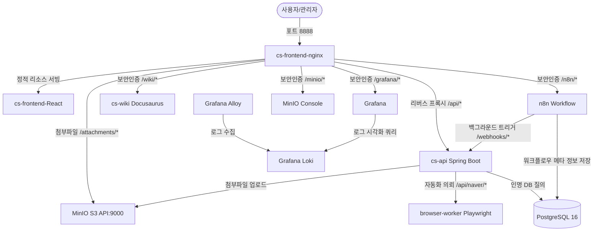

# CS Test Bed (CS 문의 및 세션 자동화 테스트베드)

이 프로젝트는 대고객 서비스 과정에서 발생하는 고객 문의(CS)의 수집, 네이버 카페 등 외부 채널로의 자동 답변 전송, 그리고 이에 필요한 네이버 로그인 세션 우회 및 백그라운드 자동화(Playwright) 과정을 실습하고 검증하기 위한 통합 테스트베드 환경입니다.

컨테이너 기반으로 설계되었으며, API 백엔드, 프론트엔드, 자동화 워커, 그리고 워크플로우 자동화 도구(n8n)와 옵저버빌리티 스택(Loki, Grafana, Alloy)이 긴밀하게 연동되어 있습니다.

---

## 🛠️ 기술 스택 및 컴포넌트

이 시스템은 단일 컴퓨터에서 Docker Compose 환경을 기반으로 유기적으로 동작하도록 설계되었습니다.



### 1. 주요 서비스 구성

* **프론트엔드 Nginx (`cs-frontend-nginx`)**: 포트 `8888`. 유일하게 호스트에 노출되는 진입점으로, 리버스 프록시 및 Basic Auth(기본 로그인 인증)를 수행합니다.
* **백엔드 API (`cs-api`)**: Spring Boot 기반 Java API 서버. 도메인 로직 처리, 데이터베이스 관리, 내부 토큰 인증 등을 수행합니다.
* **브라우저 자동화 워커 (`browser-worker`)**: Playwright 기반 Node.js 서비스. 네이버 카페 일회성 로그인 번호 처리 및 댓글 작성 자동화를 대행합니다.
* **워크플로우 엔진 (`n8n`)**: 일상적인 반복 작업 및 트리거 기반 워크플로우를 담당하는 노코드/로우코드 자동화 서비스입니다.
* **데이터베이스 (`postgres-db`)**: PostgreSQL 16. 백엔드 및 n8n의 데이터를 저장합니다.
* **오브젝트 스토리지 (`minio`)**: S3 호환 로컬 스토리지. 고객이 제출하는 캡처 이미지 등 첨부파일을 관리합니다.
* **개발 위키 (`wiki`)**: Docusaurus 기반의 정적 문서 사이트로, 프로젝트 내부 상세 가이드와 API 스펙을 실시간으로 확인하고 검색할 수 있습니다.
* **옵저버빌리티 스택 (`loki`, `grafana-alloy`, `grafana`)**: 컨테이너 로그를 안전하게 수집하여 시각화하고 모니터링하기 위한 통합 로깅 아키텍처입니다.

---

## 🚀 빠른 시작 가이드 (Quick Start)

### 개발 검증

백엔드 테스트, 프론트엔드 테스트·lint·프로덕션 빌드와 Docker Compose 설정을 루트에서 한 번에 검증할 수 있습니다.

```bash
./scripts/verify.sh
```

프론트엔드 의존성은 `apps/frontend`에서 `npm install` 또는 `npm ci`로 먼저 설치해야 합니다.

### 1. 환경 설정 (.env)

루트 폴더에 있는 `.env.example` 파일을 복사하여 `.env` 파일을 생성하고 필요한 값을 입력합니다.

```bash
cp .env.example .env
```

`.env` 파일 내부의 주요 토큰 및 비밀번호 정보를 환경에 맞춰 수정합니다. 기본 인증 파일인 `.htpasswd`도 `/infra/nginx/` 하위에 위치하는지 확인해야 합니다.

### 2. 컨테이너 환경 실행

Docker가 구동 중인 상태에서 아래 명령을 실행하여 전체 서비스를 백그라운드로 실행합니다.

```bash
docker compose up -d
```

실행 후 모든 컨테이너가 정상적으로 동작하는지 확인합니다.

```bash
docker compose ps
```

### 3. 서비스 접속 정보

모든 서비스는 프론트엔드 Nginx 포트 `8888`을 경유하여 접속합니다. (기본 Basic Auth 창이 뜨면 `.htpasswd`에 구성된 관리자 계정으로 로그인해야 접근할 수 있습니다.)

* **프론트엔드 웹 콘솔**: [http://localhost:8888/](http://localhost:8888/)
* **개발자 위키 (Wiki)**: [http://localhost:8888/wiki/](http://localhost:8888/wiki/)
* **n8n 워크플로우**: [http://localhost:8888/n8n/](http://localhost:8888/n8n/)
* **Grafana 모니터링**: [http://localhost:8888/grafana/](http://localhost:8888/grafana/)
* **MinIO 관리 도구**: [http://localhost:8888/minio/](http://localhost:8888/minio/)
* **Swagger API Docs**: [http://localhost:8888/swagger-ui/index.html](http://localhost:8888/swagger-ui/index.html)

---

## 📖 상세 개발자 문서 안내 (Wiki)

시스템 설계 사상 및 아키텍처와 관련된 상세 내용은 Docusaurus 기반의 **개발자 위키**에서 제공하고 있습니다.
로컬 컨테이너 실행 후 [http://localhost:8888/wiki/](http://localhost:8888/wiki/)에 직접 접속하거나, `docs/docs/` 아래의 Markdown 소스 파일을 직접 참조하실 수 있습니다.

* [배포 아키텍처 (Deployment Architecture)](file:///Users/shin-yoonsik/Desktop/Project/cs-test-bed-ttam/docs/docs/deployment-architecture.md)
* [인프라 아키텍처 (Infrastructure Architecture)](file:///Users/shin-yoonsik/Desktop/Project/cs-test-bed-ttam/docs/docs/infrastructure-architecture.md)
* [네트워크 아키텍처 (Network Architecture)](file:///Users/shin-yoonsik/Desktop/Project/cs-test-bed-ttam/docs/docs/network-architecture.md)
* [보안 및 인증 가이드 (Security & Auth Policy)](file:///Users/shin-yoonsik/Desktop/Project/cs-test-bed-ttam/docs/docs/security-policy.md)
* [코드 아키텍처 (Code Architecture)](file:///Users/shin-yoonsik/Desktop/Project/cs-test-bed-ttam/docs/docs/code-architecture.md)
