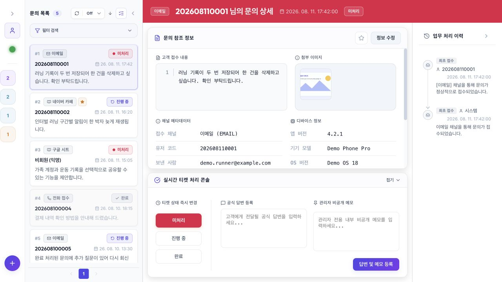
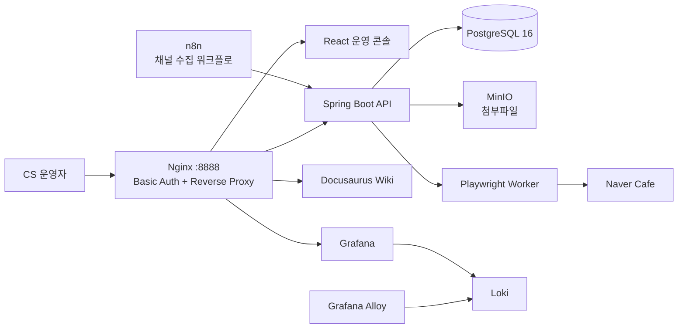
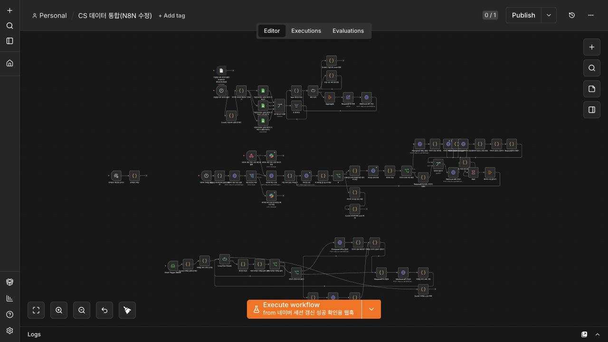
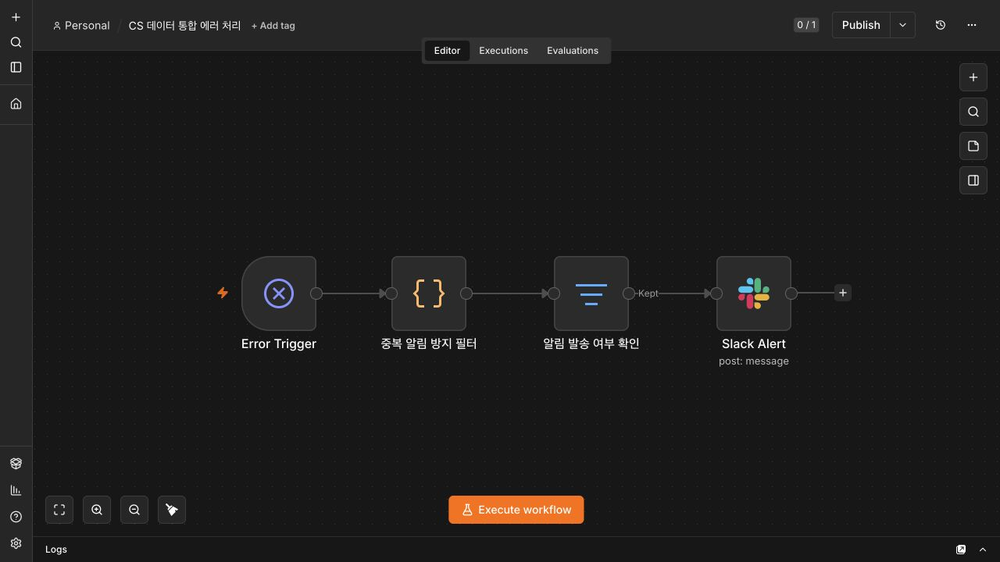
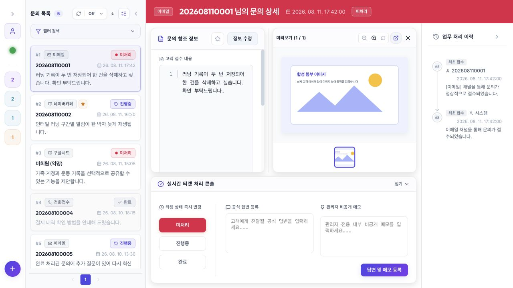
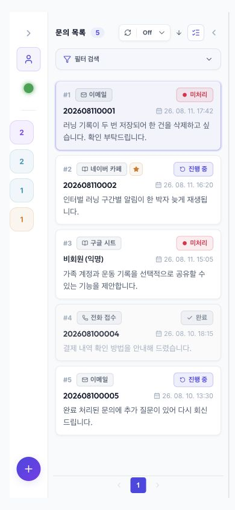
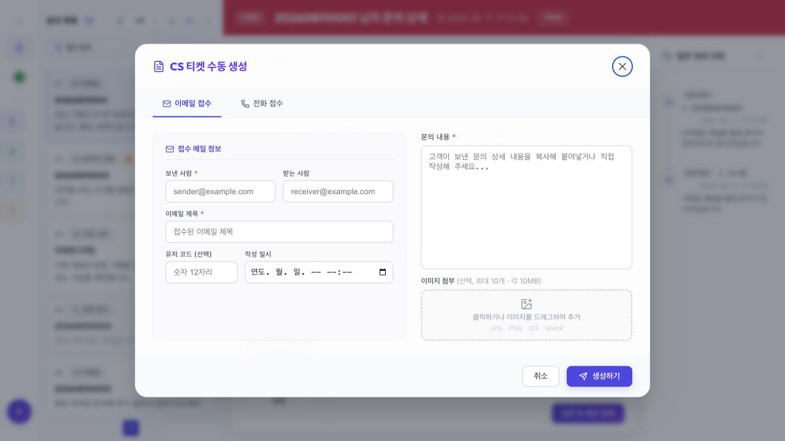

# CS Hub

이메일, 네이버 카페, 구글 시트, 전화로 흩어진 고객 문의를 한 화면에서 처리하기 위한 멀티채널 CS 운영 플랫폼입니다.

단순한 CRUD 화면보다 **중복 수집, 이메일 회신 연결, 완료 문의 재오픈, PII 보호, 외부 자동화 실패**처럼 실제 운영에서 문제가 되는 경계를 코드로 검증하는 데 집중했습니다.

## 프로젝트 배경

이 저장소는 **청년 일경험 참여 과정에서 수행한 프로젝트**를 기반으로, 멀티채널 고객 문의 수집과 상담 업무 자동화를 설계·구현하며 축적한 결과물입니다. 화면 구현에 그치지 않고 채널 수집 워크플로, API와 데이터 모델, 운영자 화면, 브라우저 자동화, 인증 경계와 관측 환경까지 하나의 시스템으로 연결했습니다.

프로젝트 종료 후에는 당시 구현을 그대로 두지 않고, 코드와 Git 이력으로 설명할 수 있는 업무 규칙을 테스트로 고정하고 책임 경계·실행 재현성·문서를 보강했습니다. 따라서 README의 설명은 현재 저장소의 코드, 테스트 또는 설정에서 확인할 수 있는 내용만 사용합니다.

## 기술 스택

| 영역 | 기술 | 적용 내용 |
| --- | --- | --- |
| Backend | Java 21, Spring Boot 3.3, Spring Security, Spring Data JPA, QueryDSL, Flyway | 문의 통합·처리 API, RBAC, 트랜잭션, 스키마 마이그레이션 |
| Frontend | React 19, TypeScript 6, Vite 8 | 문의 조회·필터·배치 처리·상세 편집 운영 콘솔 |
| Workflow | n8n | 이메일·네이버 카페·구글 시트 수집, 이미지 처리, 세션·오류 알림 |
| Browser Automation | Node.js 24, Express, Playwright | 네이버 카페 세션 검증과 브라우저 기반 작업 수행 |
| Data & Storage | PostgreSQL 16, MinIO, AWS SDK for S3 | 업무 데이터 저장, 첨부파일 업로드와 presigned URL 발급 |
| Infrastructure | Docker Compose, Nginx | 서비스 구성, Basic Auth, 리버스 프록시와 내부 네트워크 분리 |
| Observability | Micrometer Prometheus Registry, Grafana, Loki, Alloy | Prometheus 형식 메트릭 노출과 애플리케이션 로그 수집·조회 |
| Documentation & Test | Docusaurus, OpenAPI, JUnit 5, Node test runner, ESLint | API·설계 문서와 백엔드·프론트엔드·워커 자동 검증 |



## 해결하려던 문제

- 채널마다 다른 식별자와 메타데이터를 하나의 문의 모델로 수집해야 합니다.
- 폴링과 워크플로 재시도로 같은 문의가 중복 저장될 수 있습니다.
- 고객의 이메일 회신은 기존 문의에 연결되고, 완료된 문의라면 다시 열려야 합니다.
- 문의 본문과 연락처는 암호화하되 이메일 발신자 기준 검색은 가능해야 합니다.
- 관리자 브라우저, n8n, API, Playwright 워커 사이의 신뢰 경계를 구분해야 합니다.
- 자동 갱신 중에도 운영자가 보고 있던 상세 문의와 일괄 선택 맥락을 보존해야 합니다.

## 핵심 설계 판단

| 운영 문제 | 선택한 방법 | 코드로 확인 |
| --- | --- | --- |
| 중복 수집 | 채널 메타데이터에서 고유키를 만들고 저장 경계에서 중복 방지 | [InquiryUniqueKeyGenerator](apps/cs-api/src/main/java/com/ttam/cs/feature/inquiry/domain/service/InquiryUniqueKeyGenerator.java), [CustomerInquiry](apps/cs-api/src/main/java/com/ttam/cs/feature/inquiry/domain/entity/CustomerInquiry.java) |
| 이메일 회신 연결 | `In-Reply-To` → `References` → 발신자 HMAC+정규화 제목 순으로 탐색 | [EmailThreadResolver](apps/cs-api/src/main/java/com/ttam/cs/feature/inquiry/usecase/EmailThreadResolver.java), [테스트](apps/cs-api/src/test/java/com/ttam/cs/feature/inquiry/usecase/EmailThreadResolverTest.java) |
| 완료 문의 후속 회신 | `RESOLVED`인 부모만 `OPEN`으로 변경하고 시스템 작업 이력 저장 | [ResolvedInquiryReopener](apps/cs-api/src/main/java/com/ttam/cs/feature/inquiry/usecase/ResolvedInquiryReopener.java), [테스트](apps/cs-api/src/test/java/com/ttam/cs/feature/inquiry/usecase/ResolvedInquiryReopenerTest.java) |
| API 업무 오류 | 문의 부재와 잘못된 업무 요청을 타입으로 구분하고 안정적인 오류 코드로 응답 | [문의 예외](apps/cs-api/src/main/java/com/ttam/cs/feature/inquiry/exception), [HTTP 계약 테스트](apps/cs-api/src/test/java/com/ttam/cs/infra/web/exception/GlobalExceptionHandlerTest.java) |
| PII 저장과 검색 | AES-GCM 저장 암호화와 HMAC-SHA256 검색 보조값을 분리 | [PiiEncryptionUtils](apps/cs-api/src/main/java/com/ttam/cs/infra/security/crypto/PiiEncryptionUtils.java), [암호화 경계 테스트](apps/cs-api/src/test/java/com/ttam/cs/infra/security/crypto/PiiEncryptionUtilsTest.java) |
| 내부 워커 인증 | 토큰 미설정 시 fail-fast, 상수 시간 비교, 요청 토큰 비로깅 | [internalToken.js](apps/browser-worker/src/security/internalToken.js), [테스트](apps/browser-worker/test/internalToken.test.js) |
| 자동 갱신 중 사용자 맥락 | 조회·페이지 캐시·선택 유지·갱신 주기를 React 밖의 정책과 전용 훅으로 분리 | [inquiryListLoader](apps/frontend/src/features/inquiry/inquiryListLoader.ts), [pageCache](apps/frontend/src/features/inquiry/pageCache.ts), [useAutoRefresh](apps/frontend/src/hooks/useAutoRefresh.ts), [테스트](apps/frontend/tests) |
| 화면 조립과 업무 상태 분리 | 관리자 사이드바, 계정·세션 위젯, 상세 활동 조회, 필드 편집 트랜잭션, 메타데이터 섹션을 전용 컴포넌트와 훅으로 분리 | [AdminSidebar](apps/frontend/src/components/AdminSidebar.tsx), [useInquiryActivity](apps/frontend/src/hooks/useInquiryActivity.ts), [useInquiryFieldEditor](apps/frontend/src/hooks/useInquiryFieldEditor.ts), [InquiryMetadataSections](apps/frontend/src/components/InquiryMetadataSections.tsx) |
| 같은 기능의 정책 일관성 | 상태·채널·날짜·이미지 규칙, HTTP 오류, 모달·피드백을 단일 경계로 모으고 소스 스캔 테스트로 우회 구현 방지 | [inquiry policy](apps/frontend/src/features/inquiry/policy.ts), [httpClient](apps/frontend/src/api/httpClient.ts), [ModalSurface](apps/frontend/src/components/ui/ModalSurface.tsx), [convention guard](apps/frontend/tests/conventionGuard.test.ts) |
| 복합 명령의 부분 성공 | 상태·필드 수정과 작업 기록·상태 변경을 각각 한 트랜잭션으로 처리하고, 이미지 삭제는 DB 커밋 후 실행 | [UpdateInquiryUseCase](apps/cs-api/src/main/java/com/ttam/cs/feature/inquiry/usecase/UpdateInquiryUseCase.java), [RegisterInquiryWorkLogUseCase](apps/cs-api/src/main/java/com/ttam/cs/feature/inquiry/usecase/RegisterInquiryWorkLogUseCase.java), [UpdateInquiryFieldsUseCase](apps/cs-api/src/main/java/com/ttam/cs/feature/inquiry/usecase/UpdateInquiryFieldsUseCase.java) |
| 워크플로 중복 실행과 실패 알림 | 채널별 실행 lock과 동일 오류 30분 억제 | [수집 워크플로](infra/n8n/scratch_workflow.json), [공통 오류 워크플로](infra/n8n/error_workflow.json) |

## 아키텍처



사용자 웹 트래픽의 기본 진입점은 Nginx의 `8888` 포트입니다. API와 브라우저 워커는 Compose 내부 네트워크에서 통신하며 워커 호출에는 별도의 내부 토큰을 사용합니다. PostgreSQL과 MinIO 호스트 포트는 로컬 개발 도구 연동을 위해 별도로 열려 있습니다.

## n8n 자동화 흐름

n8n은 단순한 스케줄러가 아니라 서로 다른 채널 입력을 API의 공통 문의 계약으로 변환하는 수집 오케스트레이터입니다. 실제 워크플로 정의는 [수집 워크플로](infra/n8n/scratch_workflow.json)와 [공통 오류 워크플로](infra/n8n/error_workflow.json)에서 확인할 수 있습니다.

아래 화면은 저장소의 워크플로 JSON을 격리된 임시 n8n 인스턴스에 불러와 촬영했습니다. 실제 계정·토큰·실행 데이터는 포함하지 않습니다.



| 입력 채널 | n8n 처리 흐름 |
| --- | --- |
| 이메일 | IMAP 수신 → 처리 UID 중복 확인 → 본문·첨부 이미지 파싱 → presigned URL 발급 및 MinIO 업로드 → API 전송 |
| 네이버 카페 | 스케줄 실행 → 세션 상태 검증 → 게시글 페이지·상세 조회 → 이미지 업로드 → 마지막 처리 ID 기록 → API 전송 |
| 구글 시트 | 스케줄 실행 → 마지막 처리 행 확인 → 분기별 시트 조회·병합 → 빈 행 제거와 DTO 변환 → API 전송 |

재시도와 외부 서비스 장애도 워크플로의 일부로 다룹니다.

- 이메일·네이버 카페·구글 시트가 서로 막지 않도록 **채널별 독립 Lock**을 적용했습니다.
- 처리 UID·게시글 ID·시트 행 번호를 기록해 폴링과 재시도의 중복 수집을 줄였습니다.
- 이미지 다운로드 실패 항목은 성공 항목과 분리해 전체 수집이 함께 실패하지 않게 했습니다.
- 공통 오류 워크플로에서 동일 오류의 반복 알림을 30분간 억제하고 Slack으로 전달합니다.
- 네이버 세션 만료와 갱신 성공 여부도 Slack 알림으로 연결했습니다.



[동기화 스크립트](infra/n8n/n8n-sync.js)는 로컬 JSON과 n8n 컨테이너의 워크플로 정의를 양방향으로 동기화합니다. API는 고유키와 저장 제약으로 최종 중복 방지 경계를 담당합니다. 즉 n8n의 처리 기록은 수집 비용을 줄이고, 백엔드의 멱등성은 데이터 정합성을 보장하도록 역할을 나눴습니다.

## 5분 코드 투어

### 1. 멀티채널 문의가 저장되는 흐름

[IntegrateInquiryDataUseCase](apps/cs-api/src/main/java/com/ttam/cs/feature/inquiry/usecase/IntegrateInquiryDataUseCase.java)는 필터링 → 문의 생성 → 일괄 저장만 조율합니다. 세부 정책은 다음 클래스로 분리했습니다.

- [EmailIntegrationValidator](apps/cs-api/src/main/java/com/ttam/cs/feature/inquiry/usecase/EmailIntegrationValidator.java): 본문·이미지와 message-id/UID 입력 계약
- [AdminEmailSenderPolicy](apps/cs-api/src/main/java/com/ttam/cs/feature/inquiry/usecase/AdminEmailSenderPolicy.java): 관리자가 보낸 답변의 재수집 방지
- [EmailArticleUrlResolver](apps/cs-api/src/main/java/com/ttam/cs/feature/inquiry/usecase/EmailArticleUrlResolver.java): UID 우선 웹메일 링크 생성
- [EmailSenderHasher](apps/cs-api/src/main/java/com/ttam/cs/feature/inquiry/usecase/EmailSenderHasher.java): 생성·수집·스레드 검색에 동일한 발신자 정규화 적용

대표 회귀 시나리오는 [IntegrateInquiryDataUseCaseTest](apps/cs-api/src/test/java/com/ttam/cs/feature/inquiry/usecase/IntegrateInquiryDataUseCaseTest.java)에서 확인할 수 있습니다.

### 2. 이메일 회신이 기존 문의로 연결되는 흐름

[EmailThreadResolver](apps/cs-api/src/main/java/com/ttam/cs/feature/inquiry/usecase/EmailThreadResolver.java)는 명시적인 메일 헤더를 먼저 신뢰하고, 마지막 수단으로 최근 7일의 발신자 HMAC과 정규화 제목을 사용합니다. 회신의 회신은 최초 부모 ID로 연결합니다.

[ResolvedInquiryReopener](apps/cs-api/src/main/java/com/ttam/cs/feature/inquiry/usecase/ResolvedInquiryReopener.java)는 완료 문의에 새 회신이 들어온 경우만 상태와 감사 이력을 함께 변경합니다. 시간은 `Clock`으로, 시스템 작업자 정보는 [SystemOperatorProvider](apps/cs-api/src/main/java/com/ttam/cs/feature/inquiry/usecase/SystemOperatorProvider.java)로 주입해 테스트와 운영 설정을 분리했습니다.

### 3. 개인정보가 DB 경계를 통과하는 흐름

[EncryptedStringConverter](apps/cs-api/src/main/java/com/ttam/cs/infra/security/crypto/EncryptedStringConverter.java)는 JPA 저장 시 AES-GCM 암호화, 조회 시 복호화를 수행합니다. 마이그레이션 기간에는 기존 평문을 읽을 수 있지만 새 값은 암호문으로 저장합니다.

[PiiEncryptionUtilsTest](apps/cs-api/src/test/java/com/ttam/cs/infra/security/crypto/PiiEncryptionUtilsTest.java)는 다음 경계를 검증합니다.

- 동일 평문도 매번 다른 IV로 다른 암호문 생성
- GCM 인증 태그가 맞지 않는 위변조 암호문 거부
- 레거시 평문 pass-through와 암호문 판별
- 원문을 저장하지 않는 결정적 HMAC 검색 보조값

### 4. 자동 갱신 중 선택이 유지되는 흐름

대형 컴포넌트에 있던 목록 조회와 상태 정책을 [inquiryListLoader.ts](apps/frontend/src/features/inquiry/inquiryListLoader.ts), [pageCache.ts](apps/frontend/src/features/inquiry/pageCache.ts), [batchSelection.ts](apps/frontend/src/features/inquiry/batchSelection.ts), [selectedInquiry.ts](apps/frontend/src/features/inquiry/selectedInquiry.ts)로 분리했습니다. 타이머 생명주기는 [useAutoRefresh](apps/frontend/src/hooks/useAutoRefresh.ts)가 담당합니다.

- 현재 페이지 전체 선택은 다른 페이지의 선택을 훼손하지 않습니다.
- 새로고침 후 화면에서 사라진 ID만 일괄 선택에서 제거합니다.
- 선택 문의가 잠시 목록에서 사라져도 같은 ID의 상세만 유지합니다.
- 다른 ID의 오래된 상세 데이터는 표시하지 않습니다.

이 정책은 브라우저 없이 [Node 내장 테스트](apps/frontend/tests)로 실행됩니다.

`App.tsx`에서는 개인화 사이드바를 `AdminSidebar`, 목록·배치·페이지네이션을 [InquiryWorkspacePane](apps/frontend/src/components/InquiryWorkspacePane.tsx), 선택 상세를 [SelectedInquiryPane](apps/frontend/src/components/SelectedInquiryPane.tsx)으로 분리했습니다. 운영자·네이버 세션·통계·목록 리사이즈는 각각 전용 훅이 소유합니다.

`InquiryDetailPanel.tsx`에서는 작업 이력·회신 조회를 `useInquiryActivity`, 수정값 검증·이미지 업로드·저장을 `useInquiryFieldEditor`, 답변·상태·즐겨찾기 명령을 [useInquiryActions](apps/frontend/src/hooks/useInquiryActions.ts)가 담당합니다. 헤더·처리 콘솔·이력 열도 각각 독립 컴포넌트로 분리했습니다.

현재 기준으로 `App.tsx`는 2,343줄에서 776줄로, `InquiryDetailPanel.tsx`는 2,240줄에서 786줄로 줄었습니다. 줄 수 자체보다 목록 조회, 상세 편집, 처리 명령, 이력 표현을 서로 독립적으로 변경할 수 있는지를 경계로 삼았습니다.

다음 화면은 실제 고객 데이터가 아닌 [합성 fixture](scripts/showcase-server.mjs)로 이미지 선택과 확대 동작을 검증한 결과입니다.



동일한 fixture를 `390x844` viewport에서 확인해, 좁은 화면에서도 문의 목록의 채널·상태·요약과 필터 진입점이 유지되는지 검증했습니다.



### 5. 같은 기능이 같은 정책을 따르는 흐름

상태 라벨·변경 사유·사용자 코드·이미지 제약·채널 표시는 [policy.ts](apps/frontend/src/features/inquiry/policy.ts), 계정 입력 계약은 [account policy](apps/frontend/src/features/account/policy.ts)가 소유합니다. 모든 JSON 요청과 백엔드 오류 해석은 [httpClient.ts](apps/frontend/src/api/httpClient.ts)를 통과하고, 일반 모달과 사용자 피드백은 [ModalSurface](apps/frontend/src/components/ui/ModalSurface.tsx)와 [FeedbackProvider](apps/frontend/src/components/ui/FeedbackProvider.tsx)의 키보드·포커스·비동기 계약을 공유합니다.

UI에서 하나로 보이는 명령도 서버에서 하나의 업무 단위로 처리합니다. 상세 저장의 상태·필드 변경은 [UpdateInquiryUseCase](apps/cs-api/src/main/java/com/ttam/cs/feature/inquiry/usecase/UpdateInquiryUseCase.java), 답변 등록과 상태 변경은 [RegisterInquiryWorkLogUseCase](apps/cs-api/src/main/java/com/ttam/cs/feature/inquiry/usecase/RegisterInquiryWorkLogUseCase.java)가 함께 커밋합니다. 관리자 DB와 `.htpasswd` 갱신은 [AdminAccountUseCase](apps/cs-api/src/main/java/com/ttam/cs/feature/auth/usecase/AdminAccountUseCase.java)가 롤백 보상까지 조율합니다.

[conventionGuard.test.ts](apps/frontend/tests/conventionGuard.test.ts)는 공유 HTTP 클라이언트를 우회한 `fetch`, 브라우저 기본 대화상자, 공통 모달 표면을 우회한 구현이 다시 들어오지 못하게 검사합니다. 세부 규칙과 선택 이유는 [상호작용 및 업무 정책](docs/docs/interaction-policy.md)에 정리했습니다.

아래 생성 화면은 공통 모달 생명주기를 적용한 현재 구현입니다. 키보드 Escape로 닫히고 호출 버튼으로 포커스가 돌아오며, 제출이 실패하면 입력값과 인라인 오류를 유지합니다.



## 검증

루트에서 전체 검증을 실행합니다.

```bash
./scripts/verify.sh
```

검증 항목:

- Spring Boot 테스트 및 AOT 테스트 처리
- 브라우저 워커 내부 토큰 테스트
- 프론트엔드 상태 정책 테스트
- ESLint 전체 검사
- TypeScript 및 Vite 프로덕션 빌드
- Docker Compose 설정 유효성

현재 저장소 기준으로 백엔드 56개, 브라우저 워커 4개, 프론트엔드 40개 테스트가 통과합니다.

## 로컬 실행

### 요구 사항

- Java 21
- Node.js 24 이상
- Docker와 Docker Compose
- Apache `htpasswd` 명령

### 1. 환경 파일과 개발 계정 준비

```bash
cp .env.example .env
htpasswd -c infra/nginx/.htpasswd admin
```

`.env`의 placeholder 토큰과 암호화 키를 실제 개발용 값으로 교체해야 합니다. 특히 `INTERNAL_API_TOKEN`은 16자 미만이거나 알려진 placeholder이면 브라우저 워커가 기동을 거부합니다.

### 2. 프론트엔드 빌드

```bash
cd apps/frontend
npm ci
npm run build
cd ../..
```

### 3. 서비스 실행

```bash
docker compose up -d
docker compose ps
```

운영 콘솔은 [http://localhost:8888](http://localhost:8888)에서 확인할 수 있습니다. 기본 host port는 PostgreSQL `5432`, MinIO `19000/19001`, Nginx `8888`이며 `.env`에서 변경할 수 있습니다.

### DB를 사용하지 않는 showcase 화면

README 화면은 실제 문의 데이터가 아니라 읽기 전용 합성 API로 촬영했습니다.

```bash
npm --prefix apps/frontend run build
node scripts/showcase-server.mjs
```

[http://127.0.0.1:4174](http://127.0.0.1:4174)에서 같은 데이터 상태를 재현할 수 있습니다. showcase 서버는 쓰기 요청을 거부하며 PostgreSQL에 연결하지 않습니다.

## 저장소 구조

```text
apps/
  cs-api/          Spring Boot 3, JPA, Querydsl, Flyway
  frontend/        React 19, TypeScript, Vite
  browser-worker/  Express, Playwright
infra/
  nginx/           단일 진입점과 Basic Auth
  n8n/             수집 및 공통 오류 워크플로
  alloy/            로그 수집 설정
  loki/             로그 저장 설정
  postgres/         초기 스키마와 개발용 mock data
docs/               Docusaurus 개발 문서
scripts/verify.sh   저장소 통합 검증 진입점
scripts/showcase-server.mjs  DB 없는 README 화면 재현 서버
```

## 의도적으로 감수한 한계

- Compose 단일 호스트 환경을 전제로 하므로 고가용성 배포 구성은 포함하지 않습니다.
- n8n의 workflow static data lock은 동일 워크플로 중복 실행을 줄이지만 분산 lock은 아닙니다.
- Playwright 자동화는 외부 사이트 DOM과 세션 정책 변경에 영향을 받습니다.
- Basic Auth는 로컬·사설 운영 환경의 1차 경계이며, 인터넷 공개 환경이라면 SSO/OIDC와 TLS 종단 구성이 필요합니다.

## 상세 문서

- [ADR-001 이메일 스레드 연결](docs/docs/adr/001-email-thread-resolution.md)
- [ADR-002 PII 저장과 검색](docs/docs/adr/002-pii-storage-and-search.md)
- [ADR-003 워커 내부 토큰](docs/docs/adr/003-worker-internal-token.md)
- [리팩터링 로드맵](docs/docs/refactoring-roadmap.md)
- [코드 아키텍처](docs/docs/code-architecture.md)
- [상호작용 및 업무 정책](docs/docs/interaction-policy.md)
- [인프라 아키텍처](docs/docs/infrastructure-architecture.md)
- [네트워크 아키텍처](docs/docs/network-architecture.md)
- [보안 정책](docs/docs/security-policy.md)
- [PII 암호화 마이그레이션](docs/docs/pii-encryption-migration.md)
- [로깅 및 옵저버빌리티](docs/docs/logging-observability-policy.md)
