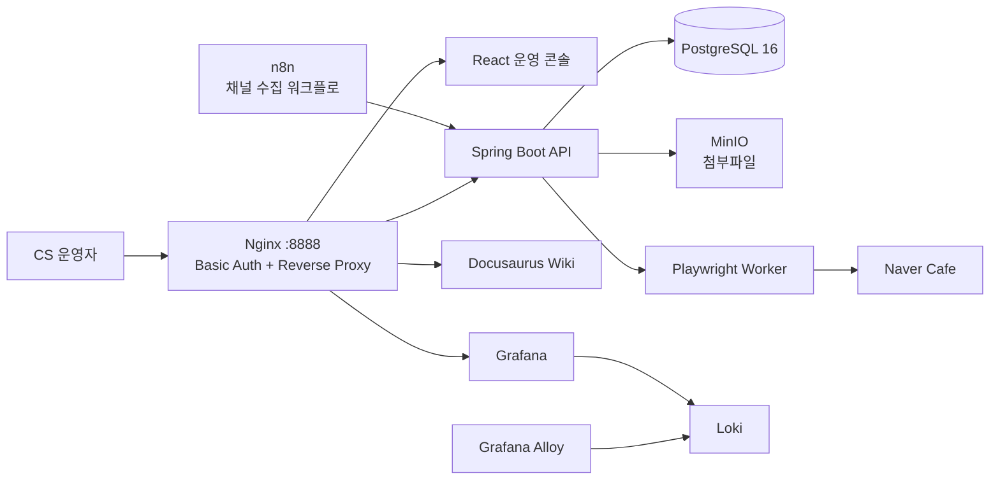

# CS Operations Test Bed

이메일, 네이버 카페, 구글 시트, 전화로 흩어진 고객 문의를 한 화면에서 처리하기 위한 멀티채널 CS 운영 테스트베드입니다.

단순한 CRUD 화면보다 **중복 수집, 이메일 회신 연결, 완료 문의 재오픈, PII 보호, 외부 자동화 실패**처럼 실제 운영에서 문제가 되는 경계를 코드로 검증하는 데 집중했습니다.

## 해결하려던 문제

- 채널마다 다른 식별자와 메타데이터를 하나의 문의 모델로 수집해야 합니다.
- 폴링과 워크플로 재시도로 같은 문의가 중복 저장될 수 있습니다.
- 고객의 이메일 회신은 기존 문의에 연결되고, 완료된 문의라면 다시 열려야 합니다.
- 문의 본문과 연락처는 암호화하되 이메일 발신자 기준 검색은 가능해야 합니다.
- 관리자 브라우저, n8n, API, Playwright 워커 사이의 신뢰 경계를 구분해야 합니다.
- 자동 갱신 중에도 운영자가 보고 있던 상세 문의와 일괄 선택 맥락을 보존해야 합니다.

## 핵심 설계 판단

| 운영 문제 | 선택한 방법 | 코드로 확인 |
| --- | --- | --- |
| 중복 수집 | 채널 메타데이터에서 고유키를 만들고 저장 경계에서 중복 방지 | [InquiryUniqueKeyGenerator](apps/cs-api/src/main/java/com/ttam/cs/feature/inquiry/domain/service/InquiryUniqueKeyGenerator.java), [CustomerInquiry](apps/cs-api/src/main/java/com/ttam/cs/feature/inquiry/domain/entity/CustomerInquiry.java) |
| 이메일 회신 연결 | `In-Reply-To` → `References` → 발신자 HMAC+정규화 제목 순으로 탐색 | [EmailThreadResolver](apps/cs-api/src/main/java/com/ttam/cs/feature/inquiry/usecase/EmailThreadResolver.java), [테스트](apps/cs-api/src/test/java/com/ttam/cs/feature/inquiry/usecase/EmailThreadResolverTest.java) |
| 완료 문의 후속 회신 | `RESOLVED`인 부모만 `OPEN`으로 변경하고 시스템 작업 이력 저장 | [ResolvedInquiryReopener](apps/cs-api/src/main/java/com/ttam/cs/feature/inquiry/usecase/ResolvedInquiryReopener.java), [테스트](apps/cs-api/src/test/java/com/ttam/cs/feature/inquiry/usecase/ResolvedInquiryReopenerTest.java) |
| PII 저장과 검색 | AES-GCM 저장 암호화와 HMAC-SHA256 검색 보조값을 분리 | [PiiEncryptionUtils](apps/cs-api/src/main/java/com/ttam/cs/infra/security/crypto/PiiEncryptionUtils.java), [암호화 경계 테스트](apps/cs-api/src/test/java/com/ttam/cs/infra/security/crypto/PiiEncryptionUtilsTest.java) |
| 내부 워커 인증 | 토큰 미설정 시 fail-fast, 상수 시간 비교, 요청 토큰 비로깅 | [internalToken.js](apps/browser-worker/src/security/internalToken.js), [테스트](apps/browser-worker/test/internalToken.test.js) |
| 자동 갱신 중 사용자 맥락 | 선택 정책과 상세 유지 규칙을 React 밖의 순수 함수로 분리 | [batchSelection](apps/frontend/src/features/inquiry/batchSelection.ts), [selectedInquiry](apps/frontend/src/features/inquiry/selectedInquiry.ts), [테스트](apps/frontend/tests) |
| 워크플로 중복 실행과 실패 알림 | 채널별 실행 lock과 동일 오류 30분 억제 | [수집 워크플로](infra/n8n/scratch_workflow.json), [공통 오류 워크플로](infra/n8n/error_workflow.json) |

## 아키텍처



사용자 웹 트래픽의 기본 진입점은 Nginx의 `8888` 포트입니다. API와 브라우저 워커는 Compose 내부 네트워크에서 통신하며 워커 호출에는 별도의 내부 토큰을 사용합니다. PostgreSQL과 MinIO 호스트 포트는 로컬 개발 도구 연동을 위해 별도로 열려 있습니다.

## 5분 코드 투어

### 1. 멀티채널 문의가 저장되는 흐름

[IntegrateInquiryDataUseCase](apps/cs-api/src/main/java/com/ttam/cs/feature/inquiry/usecase/IntegrateInquiryDataUseCase.java)는 필터링 → 문의 생성 → 일괄 저장만 조율합니다. 세부 정책은 다음 클래스로 분리했습니다.

- [EmailIntegrationValidator](apps/cs-api/src/main/java/com/ttam/cs/feature/inquiry/usecase/EmailIntegrationValidator.java): 본문·이미지와 message-id/UID 입력 계약
- [AdminEmailSenderPolicy](apps/cs-api/src/main/java/com/ttam/cs/feature/inquiry/usecase/AdminEmailSenderPolicy.java): 관리자가 보낸 답변의 재수집 방지
- [EmailArticleUrlResolver](apps/cs-api/src/main/java/com/ttam/cs/feature/inquiry/usecase/EmailArticleUrlResolver.java): UID 우선 웹메일 링크 생성
- [EmailSenderHasher](apps/cs-api/src/main/java/com/ttam/cs/feature/inquiry/usecase/EmailSenderHasher.java): 생성·수집·스레드 검색에 동일한 발신자 정규화 적용

대표 회귀 시나리오는 [IntegrateInquiryDataUseCaseTest](apps/cs-api/src/test/java/com/ttam/cs/feature/inquiry/usecase/IntegrateInquiryDataUseCaseTest.java)에서 확인할 수 있습니다.

### 2. 이메일 회신이 기존 문의로 연결되는 흐름

[EmailThreadResolver](apps/cs-api/src/main/java/com/ttam/cs/feature/inquiry/usecase/EmailThreadResolver.java)는 명시적인 메일 헤더를 먼저 신뢰하고, 마지막 수단으로 최근 7일의 발신자 HMAC과 정규화 제목을 사용합니다. 회신의 회신은 최초 부모 ID로 연결합니다.

[ResolvedInquiryReopener](apps/cs-api/src/main/java/com/ttam/cs/feature/inquiry/usecase/ResolvedInquiryReopener.java)는 완료 문의에 새 회신이 들어온 경우만 상태와 감사 이력을 함께 변경합니다. 시간은 `Clock`으로 주입해 테스트를 결정적으로 만들었습니다.

### 3. 개인정보가 DB 경계를 통과하는 흐름

[EncryptedStringConverter](apps/cs-api/src/main/java/com/ttam/cs/infra/security/crypto/EncryptedStringConverter.java)는 JPA 저장 시 AES-GCM 암호화, 조회 시 복호화를 수행합니다. 마이그레이션 기간에는 기존 평문을 읽을 수 있지만 새 값은 암호문으로 저장합니다.

[PiiEncryptionUtilsTest](apps/cs-api/src/test/java/com/ttam/cs/infra/security/crypto/PiiEncryptionUtilsTest.java)는 다음 경계를 검증합니다.

- 동일 평문도 매번 다른 IV로 다른 암호문 생성
- GCM 인증 태그가 맞지 않는 위변조 암호문 거부
- 레거시 평문 pass-through와 암호문 판별
- 원문을 저장하지 않는 결정적 HMAC 검색 보조값

### 4. 자동 갱신 중 선택이 유지되는 흐름

대형 컴포넌트에 있던 선택 로직을 [batchSelection.ts](apps/frontend/src/features/inquiry/batchSelection.ts)와 [selectedInquiry.ts](apps/frontend/src/features/inquiry/selectedInquiry.ts)로 분리했습니다.

- 현재 페이지 전체 선택은 다른 페이지의 선택을 훼손하지 않습니다.
- 새로고침 후 화면에서 사라진 ID만 일괄 선택에서 제거합니다.
- 선택 문의가 잠시 목록에서 사라져도 같은 ID의 상세만 유지합니다.
- 다른 ID의 오래된 상세 데이터는 표시하지 않습니다.

이 정책은 브라우저 없이 [Node 내장 테스트](apps/frontend/tests)로 실행됩니다.

## 검증

루트에서 전체 검증을 실행합니다.

```bash
./scripts/verify.sh
```

검증 항목:

- Spring Boot 테스트 및 AOT 테스트 처리
- 브라우저 워커 내부 토큰 테스트
- 프론트엔드 상태 정책 테스트
- ESLint 전체 검사
- TypeScript 및 Vite 프로덕션 빌드
- Docker Compose 설정 유효성

현재 저장소 기준으로 백엔드 40개, 브라우저 워커 4개, 프론트엔드 11개 테스트가 통과합니다.

## 로컬 실행

### 요구 사항

- Java 21
- Node.js 24 이상
- Docker와 Docker Compose
- Apache `htpasswd` 명령

### 1. 환경 파일과 개발 계정 준비

```bash
cp .env.example .env
htpasswd -c infra/nginx/.htpasswd admin
```

`.env`의 placeholder 토큰과 암호화 키를 실제 개발용 값으로 교체해야 합니다. 특히 `INTERNAL_API_TOKEN`은 16자 미만이거나 알려진 placeholder이면 브라우저 워커가 기동을 거부합니다.

### 2. 프론트엔드 빌드

```bash
cd apps/frontend
npm ci
npm run build
cd ../..
```

### 3. 서비스 실행

```bash
docker compose up -d
docker compose ps
```

운영 콘솔은 [http://localhost:8888](http://localhost:8888)에서 확인할 수 있습니다. 로컬에서 이미 `5432`, `9000`, `9001`, `8888` 포트를 사용 중이면 Compose 포트 충돌을 먼저 해결해야 합니다.

## 저장소 구조

```text
apps/
  cs-api/          Spring Boot 3, JPA, Querydsl, Flyway
  frontend/        React 19, TypeScript, Vite
  browser-worker/  Express, Playwright
infra/
  nginx/           단일 진입점과 Basic Auth
  n8n/             수집 및 공통 오류 워크플로
  alloy/            로그 수집 설정
  loki/             로그 저장 설정
  postgres/         초기 스키마와 개발용 mock data
docs/               Docusaurus 개발 문서
scripts/verify.sh   저장소 통합 검증 진입점
```

## 의도적으로 감수한 한계

- Compose 단일 호스트 환경을 전제로 하므로 고가용성 배포 구성은 포함하지 않습니다.
- n8n의 workflow static data lock은 동일 워크플로 중복 실행을 줄이지만 분산 lock은 아닙니다.
- Playwright 자동화는 외부 사이트 DOM과 세션 정책 변경에 영향을 받습니다.
- Basic Auth는 로컬·사설 운영 환경의 1차 경계이며, 인터넷 공개 환경이라면 SSO/OIDC와 TLS 종단 구성이 필요합니다.
- 프론트엔드의 목록 캐시·자동 갱신과 상세 타임라인은 추가 hook/컴포넌트 분리 대상으로 남아 있습니다.

## 상세 문서

- [리팩터링 로드맵](docs/docs/refactoring-roadmap.md)
- [코드 아키텍처](docs/docs/code-architecture.md)
- [인프라 아키텍처](docs/docs/infrastructure-architecture.md)
- [네트워크 아키텍처](docs/docs/network-architecture.md)
- [보안 정책](docs/docs/security-policy.md)
- [PII 암호화 마이그레이션](docs/docs/pii-encryption-migration.md)
- [로깅 및 옵저버빌리티](docs/docs/logging-observability-policy.md)
