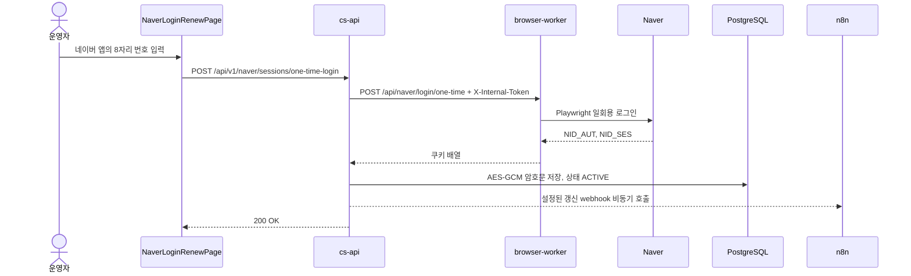

# 네이버 세션 자동화

네이버 비공개 카페 연동은 운영자가 발급한 8자리 일회용 번호로 세션을 갱신하고, 암호화해 저장한 쿠키를 n8n 수집과 댓글 자동화에 사용한다. Redis나 외부 메시지 브로커 없이 `cs-api`와 `browser-worker`가 Docker 내부 HTTP로 직접 통신한다.

## 구성과 갱신 흐름



사용자가 발급한 일회용 번호가 유효하지 않거나 워커가 20초 안에 응답하지 않으면 백엔드는 `502 Bad Gateway`로 끝내며 기존 DB 세션을 덮어쓰지 않는다.

## 구현 지도

### browser-worker

- `apps/browser-worker/server.js`: 내부 Express API 라우팅
- `apps/browser-worker/src/security/internalToken.js`: 시작 설정 검증과 요청 토큰 비교
- `apps/browser-worker/src/browser.js`: Chromium context, locale, User-Agent와 저장 쿠키 주입
- `apps/browser-worker/src/tasks/naverCafe.js`: `oneTimeLogin`, `postComment`, `validateSession`

워커 endpoint는 다음 세 가지다.

```text
POST /api/naver/login/one-time
POST /api/naver/comment
POST /api/naver/session/validate
```

워커는 호스트 포트를 publish하지 않고 `X-Internal-Token`이 유효한 내부 요청만 처리한다.

### cs-api

- `feature/auth/api/v1/controller/NaverSessionController.java`: 세션 HTTP 계약
- `feature/auth/usecase/NaverSessionUseCase.java`: 워커 호출, 상태 동기화, 알림 cooldown, 갱신 webhook 호출
- `feature/auth/domain/entity/NaverCafeSession.java`: 암호문, 상태, 갱신 시각
- `infra/security/crypto/EncryptionUtils.java`: `NAVER_SESSION_SECRET` 전용 AES-GCM 암복호화

백엔드 API는 다음과 같다.

```text
POST /api/v1/naver/sessions                     내부 시스템의 쿠키 저장
POST /api/v1/naver/sessions/one-time-login      운영자의 일회용 로그인
GET  /api/v1/naver/sessions?id=                 n8n용 세션 조회
POST /api/v1/naver/sessions/expire?id=          명시적 만료
POST /api/v1/naver/sessions/sync?id=            실제 로그인 상태 검사
GET  /api/v1/naver/sessions/status?id=          저장 상태 조회
```

쿠키 저장과 조회 API에는 `@RequireInternalAuth`가 적용된다. 운영자용 갱신·만료·상태 API는 일반 앱 인증 경계를 통과한다.

### frontend

- `apps/frontend/src/components/NaverLoginRenewPage.tsx`: 8자리 입력과 갱신 결과 표시
- `apps/frontend/src/api/inquiryApi.ts`: 세션 갱신·상태·검증 API 호출
- `apps/frontend/src/App.tsx`: `/naver-login` 화면과 상단 세션 상태 위젯 연결

## 저장과 전달 정책

`NaverSessionUseCase`는 워커가 반환한 쿠키 중 `NID_AUT`, `NID_SES`만 남기고 `NAVER_SESSION_SECRET` 기반 AES-GCM으로 암호화한다. 암호문은 `naver_cafe_sessions.encrypted_cookies`에 저장한다.

`GET /api/v1/naver/sessions`는 내부 n8n 호출을 위해 세션을 복호화하지만 JSON body에는 쿠키를 넣지 않는다. 쿠키는 다음 응답 헤더로 전달한다.

- 각 쿠키의 `Set-Cookie`
- 수집 요청에 바로 사용할 수 있는 `X-Naver-Cookie: NID_AUT=...; NID_SES=...`

헤더도 민감정보이므로 n8n execution 저장, reverse proxy access log, 오류 로그에서 해당 값을 기록하지 않아야 한다. “body가 아니다”라는 사실만으로 안전해지는 것은 아니다.

AES-GCM으로 복호화할 수 없는 구형·손상 암호문은 세션을 `EXPIRED`로 바꾸고 재로그인을 요구한다.

## n8n 연동

수집 전에 다음 순서로 세션을 확인한다.

```text
POST /api/v1/naver/sessions/sync
  -> valid=true: GET /api/v1/naver/sessions의 X-Naver-Cookie로 수집 계속
  -> valid=false, shouldAlert=true: Slack 갱신 알림 후 수집 중단
  -> valid=false, shouldAlert=false: cooldown 중이므로 추가 알림 없이 중단
```

세션이 처음 `EXPIRED`로 전환될 때 알림하고, 만료 상태가 지속되면 3시간 cooldown 뒤 다시 알림할 수 있도록 `shouldAlert`를 계산한다.

일회용 로그인이 성공하면 `NAVER_SESSION_RENEW_TRIGGER_URL`이 설정된 경우 백엔드가 해당 URL을 비동기로 호출한다. 현재 예시 값과 워크플로우 경로는 다음과 같다.

```text
http://n8n:5678/webhook/naver-session-refreshed
```

## 운영 절차

1. `http://<서버-IP>:8888/naver-login`에 접속해 Basic Auth를 통과한다.
2. 네이버 앱의 로그인 아이디 관리에서 일회용 로그인 번호 8자리를 발급한다.
3. 번호를 즉시 입력하고 갱신 성공을 확인한다.
4. 상단 세션 위젯 또는 `GET /api/v1/naver/sessions/status`에서 `ACTIVE`를 확인한다.
5. 즉시 수집이 필요하면 갱신 webhook 실행 결과를 확인하거나 n8n 워크플로우를 수동 실행한다.

## 운영 제약

- 일회용 번호, 쿠키, `INTERNAL_API_TOKEN`, 암호화 키를 로그나 문서 예시에 남기지 않는다.
- `INTERNAL_API_TOKEN`, `NAVER_SESSION_SECRET`은 `.env.example` 값을 그대로 사용하지 않는다.
- browser-worker와 cs-api 사이의 HTTP는 암호화되지 않는다. 단일 신뢰 호스트의 Docker bridge라는 현재 전제를 벗어나면 TLS를 추가한다.
- Playwright selector는 네이버 화면 변경에 영향을 받으므로 mock 테스트와 실제 갱신 점검을 구분해 수행한다.
