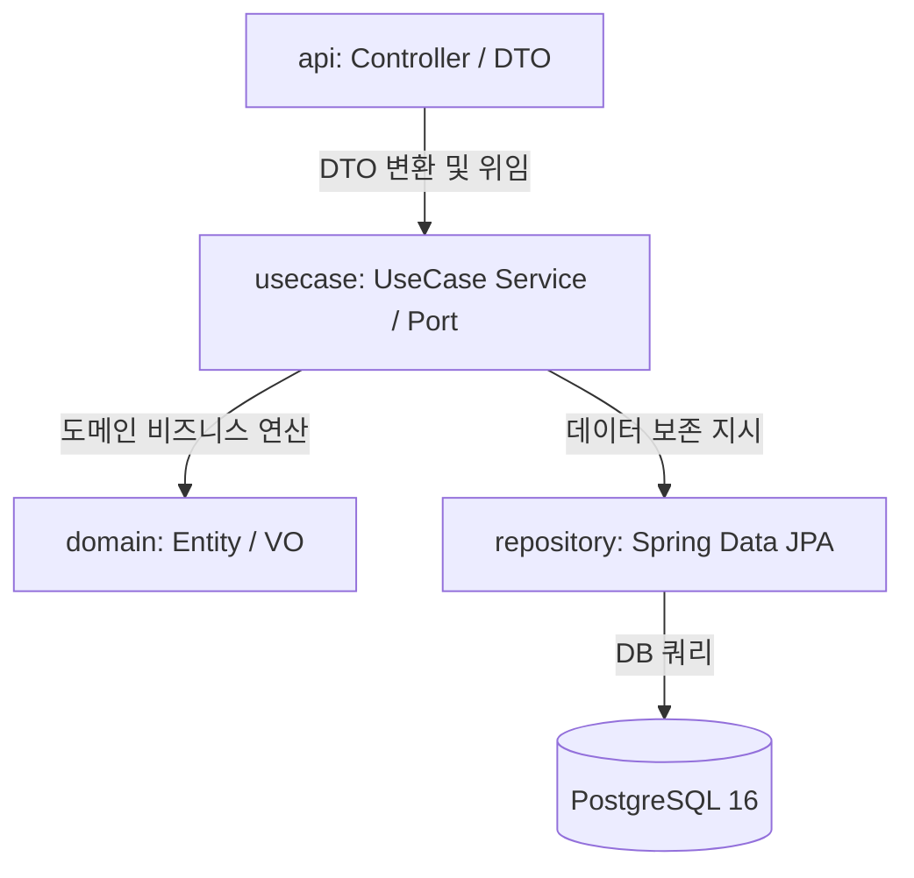
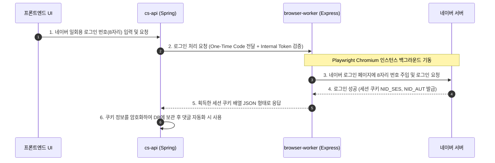

# 코드 아키텍처 (Code Architecture)

이 문서는 CS 테스트베드 애플리케이션군의 각 레이어별 코드 설계 양식, 디렉토리 패키지 구조 및 데이터 흐름 패턴을 설명합니다.

---

## ☕ 1. 백엔드 (cs-api: Spring Boot)

백엔드 애플리케이션은 Spring Boot 기반 Java 21로 빌드되었으며, 특정 도메인 단위로 책임을 분리하고 구현체를 숨기는 **유스케이스 주도 아키텍처(Usecase-driven Architecture)** 양식을 띱니다.

### 📂 디렉토리 패키지 구조

경로: `apps/cs-api/src/main/java/com/ttam/cs/`

* **`common/`**: 프로젝트 전반에 공유되는 공통 로직.
  * 예외 처리기(GlobalExceptionHandler), API 공통 응답 포맷(ApiResponse), 유틸리티 등.
* **`infra/`**: 프레임워크 기술 의존적인 외부 아댑터 및 인프라 구현체.
  * Spring Security 설정, CORS 정책, S3(MinIO) 파일 업로더 구현체, 로깅용 로깅 애스펙트(AOP) 등.
* **`feature/`**: 실질적인 기능별 수직 슬라이스(Vertical Slice) 폴더. 각 피처(예: `inquiry`, `auth`, `file`)는 내부에 다음과 같은 계층 구조를 갖습니다.
  * **`api/`**: 컨트롤러(Controller) 및 요청/응답 DTO 정의부.
  * **`usecase/`**: 인터페이스 기반의 유스케이스 정의 및 비즈니스 시나리오를 실행하는 서비스(Service) 레이어.
  * **`domain/`**: 데이터베이스 엔티티(Entity, 예: `CustomerInquiry`) 및 도메인 값 객체(Value Object, 예: `NaverCafeMetadata`).
  * **`repository/`**: Spring Data JPA 레포지토리 인터페이스 정의 레이어.

---

## ⚛️ 2. 프론트엔드 (frontend: React + Vite)

프론트엔드 서비스는 React 19, TypeScript, Vite 환경으로 빌드되었으며 단일 정적 웹 리소스(SPA)로 컴파일되어 Nginx를 통해 브라우저에 공급됩니다.

### 📂 디렉토리 구조

경로: `apps/frontend/`

* **`src/main.tsx`**: React Virtual DOM을 생성하고 CSS 테마 및 앱을 마운트하는 최상위 진입점.
* **`src/App.tsx`**: CS 문의 목록 레이아웃, 필터링 조건 상태 관리, 자동 갱신 트리거 및 API 통신 처리를 담당하는 핵심 허브 컴포넌트.
* **`src/components/`**: 세부 UI 컴포넌트 격리 공간.
  * `InquiryDetailPanel.tsx`: 문의 상세 정보 패널, 댓글 전송 폼, 네이버 로그인 일회성 번호 입력 모달 등을 포함.
* **`src/api/`**: 백엔드 API와의 통신을 규격화하기 위한 Axios HTTP 통신 래퍼 패키지.
  * `inquiryApi.ts`: 문의 목록 요청, 댓글 작성 요청, 네이버 로그인 연동 요청 등의 API 함수 집합.
* **`src/types/`**: 백엔드 응답 형태와 프론트 상태 모델을 일치시키기 위한 TypeScript 인터페이스 선언부.

---

## 🤖 3. 브라우저 워커 (browser-worker: Node.js + Playwright)

네이버 카페 등 자동 로그인 방지 캡차(CAPTCHA) 및 세션 만료 제약이 강한 플랫폼을 우회하기 위해 Playwright 브라우저 자동화 라이브러리를 가동하는 독립 백업 워커입니다.

* **웹 프레임워크**: Express.js를 사용하여 Spring Boot와 HTTP 통신망을 수립합니다.
* **보안 미들웨어**: `server.js` 최상단에 토큰 유효성 검사 코드를 내장하여, 유효한 `X-Internal-Token`이 포함된 호출에만 응답합니다.
* **캡차/자동 로그인 우회 (`naverCafe.js`)**:
  * `playwright-extra` 및 `puppeteer-extra-plugin-stealth` 라이브러리를 사용하여 브라우저 자동 제어 핑거프린트 정보를 우회합니다.
  * 직접 ID/비밀번호를 타이핑하는 대신, 모바일 OTP/일회성 번호(8자리 번호)를 브라우저 인스턴스에 가상 주입하여 크롤러 차단 필터를 안정적으로 회피하도록 설계되었습니다.
