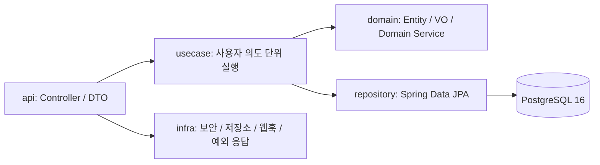
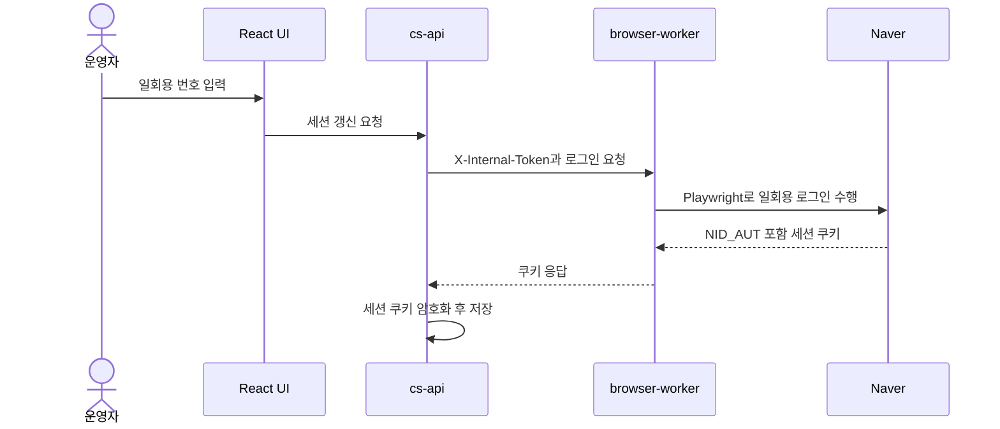

# 코드 아키텍처

이 문서는 현재 소스 트리를 기준으로 백엔드, 프론트엔드, 브라우저 워커의 책임과 호출 흐름을 설명한다.

## 백엔드: Spring Boot

`apps/cs-api`는 Java 21과 Spring Boot를 사용한다. 기능은 `auth`, `file`, `inquiry` 수직 슬라이스로 나누고, 프레임워크 공통 구현은 `infra`에 둔다.

경로: `apps/cs-api/src/main/java/com/ttam/cs/`

- `common/`: 커서 페이지 DTO, 업무 예외와 오류 코드, 이메일·UUID 유틸리티처럼 기술 계층에 종속되지 않는 공통 타입
- `feature/<기능>/api`: HTTP 컨트롤러와 버전별 요청·응답 DTO
- `feature/<기능>/usecase`: 하나의 요청 또는 사용자 의도 단위 애플리케이션 로직. 대부분 구체 컴포넌트이며, 교체가 필요한 경계에만 Port 인터페이스를 둔다.
- `feature/<기능>/domain`: 엔티티, 값 객체, 도메인 서비스
- `feature/<기능>/repository`: Spring Data JPA 저장소
- `infra/config`: Security, OpenAPI, QueryDSL, S3, RestClient, 요청·응답 로깅 설정
- `infra/security`: Nginx 헤더 인증, 역할·내부 토큰 검증, AES-GCM 기반 PII 변환
- `infra/storage`: S3 호환 저장소 구현
- `infra/web`: 문서 리다이렉트와 전역 오류 응답. `GlobalExceptionHandler`와 `ErrorResponse`가 이 경로에 있다.
- `infra/webhooks`: Kakao·n8n 웹훅 DTO, 라우팅, 타임아웃과 전용 로그

유스케이스를 모두 인터페이스로 만들지 않는다. 시간, 시스템 작업자처럼 테스트에서 교체해야 하는 외부 경계는 Port로 분리하고, 단일 구현만 존재하는 업무 흐름은 구체 클래스로 유지한다.

## 프론트엔드: React + Vite

`apps/frontend`는 React 19, TypeScript, Vite로 빌드한 SPA다. 빌드 결과인 `dist`를 `frontend` Compose 서비스의 Nginx가 직접 제공한다.

- `src/App.tsx`: 문의 작업 화면을 조립하고 선택 상태와 모달을 연결하는 최상위 오케스트레이터
- `src/api/inquiryApi.ts`: 브라우저 기본 `fetch`를 사용하는 API 함수와 HTTP 오류 변환
- `src/components/`: 화면 표현과 사용자 입력 책임
  - `AdminSidebar.tsx`: 사이드바 접힘·폭·위젯 및 저장 필터 순서 관리
  - `OperatorWidget.tsx`: 계정 정보와 권한별 관리자 도구 진입점
  - `NaverSessionWidget.tsx`: 네이버 세션 상태 표시와 갱신 명령
  - `InquiryDetailPanel.tsx`: 선택 문의의 상세 섹션과 처리 명령 조립
  - `InquiryMetadataSections.tsx`: 채널별 메타데이터와 디바이스 표시·편집
  - `InquiryActionModal.tsx`: 상태 변경·작업 기록·즐겨찾기 확인 계약
  - `InquiryTimeline.tsx`: 작업 로그·회신 타임라인 표현
  - `InquiryImageViewer.tsx`: 이미지 선택, 확대 보기, 키보드 탐색
  - `NaverLoginRenewPage.tsx`: 네이버 일회용 로그인 흐름
- `src/features/inquiry/`: 페이지 캐시, 목록 병합, 선택 유지, 일괄 선택, 이미지·타임라인 변환 같은 순수 정책
- `src/hooks/useAutoRefresh.ts`: 자동 갱신 주기와 실행 생명주기
- `src/hooks/useInquiryActivity.ts`: 작업 이력·회신 조회와 외부 데이터 갱신
- `src/hooks/useInquiryFieldEditor.ts`: 필드 변경 감지, 사유 검증, 이미지 업로드와 저장
- `src/types/inquiry.ts`: 서버 계약과 UI 상태에 사용하는 TypeScript 타입

`App.tsx`는 API 상태와 문의 작업 흐름을 조율하고, `InquiryDetailPanel.tsx`는 상세 화면 배치와 사용자 명령을 조립한다. 사이드바 개인화와 상세 데이터 조회·편집은 전용 컴포넌트와 훅이 소유한다. 순수 사용자 맥락 정책은 DOM 없이 테스트하고, 컴포넌트 조합은 합성 showcase를 데스크톱과 `390x844`에서 실행해 검증한다.

## 브라우저 워커: Node.js + Playwright

`apps/browser-worker`는 네이버 카페의 일회용 로그인, 세션 검증, 댓글 등록을 브라우저로 수행하는 내부 서비스다. CAPTCHA를 해제하거나 보안 장치를 우회하는 서비스가 아니라, 사용자가 발급한 일회용 번호와 저장된 세션을 사용해 실제 브라우저 상호작용을 자동화한다.

- `server.js`: `/api/naver/login/one-time`, `/api/naver/comment`, `/api/naver/session/validate` 제공
- `src/security/internalToken.js`: 시작 시 토큰 설정을 검증하고 요청 토큰을 상수 시간 비교
- `src/browser.js`: `playwright-extra`와 stealth 플러그인으로 브라우저 자동화 특유의 식별 신호를 줄이고 컨텍스트 생성 책임을 캡슐화
- `src/tasks/naverCafe.js`: 일회용 로그인, 댓글·답글 등록, 세션 유효성 확인

워커는 Docker 내부망에서만 열리고, 모든 API 요청은 `X-Internal-Token`을 통과해야 한다.
