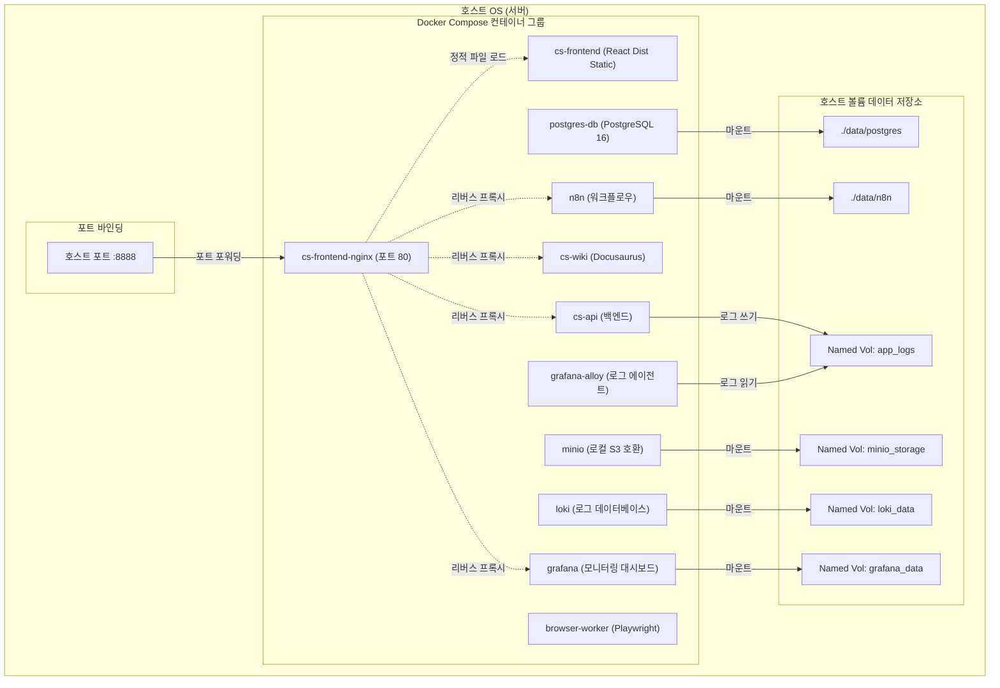
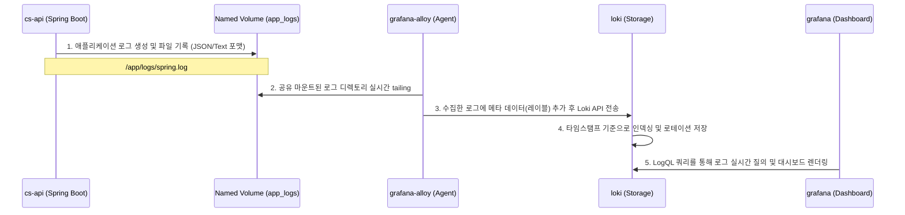

# 배포 아키텍처 (Deployment Architecture)

이 문서는 CS 테스트베드 시스템의 컴포넌트 배포 모델, 호스트 리소스 마운트 전략 및 실시간 모니터링 로그 수집 흐름을 명세합니다.

---

## 🏗️ 단일 노드 컨테이너 아키텍처

현재 전체 시스템은 1대의 호스트 머신 내에서 **Docker Compose**를 기반으로 각 컨테이너가 오케스트레이션되어 동작하는 **단일 노드(Single-Node) 배포 형태**로 구성되어 있습니다.

---

## 💾 볼륨 마운트 및 데이터 영속화 전략

컨테이너가 종료되거나 업데이트되더라도 시스템 상태 및 사용자 데이터가 유실되지 않도록 다음과 같은 영속화(Volume Mount) 전략을 채택하고 있습니다.

| 컨테이너 서비스 | 마운트 유형 | 호스트 경로 (Host Source) | 컨테이너 경로 (Container Target) | 목 적 |
| :--- | :--- | :--- | :--- | :--- |
| **postgres-db** | Bind Mount | `./data/postgres` | `/var/lib/postgresql/data` | PostgreSQL 데이터베이스의 실제 데이터 보존 |
| **postgres-db** | Bind Mount | `./infra/postgres/init-postgres.sql` | `/docker-entrypoint-initdb.d/init-postgres.sql` | 초기 구동 시 DB 및 스키마 자동 설치 스크립트 실행 |
| **n8n** | Bind Mount | `./data/n8n` | `/home/node/.n8n` | n8n 사용자 워크플로우 구성 및 자격증명 상태 보존 |
| **minio** | Named Volume | `minio_storage` | `/data` | 로컬 S3 저장소에 업로드된 대고객 CS 첨부파일 영속 저장 |
| **cs-api** | Named Volume | `app_logs` | `/app/logs` | Spring Boot 애플리케이션의 텍스트 로그 파일 출력 및 로깅 공유 |
| **grafana-alloy** | Named Volume | `app_logs` (Read-only) | `/app/logs` | `cs-api`가 쓴 로그 파일을 수집하기 위한 읽기 전용 공유 마운트 |
| **loki** | Named Volume | `loki_data` | `/loki` | 수집된 시스템 로그 파일 보관 데이터베이스 |
| **grafana** | Named Volume | `grafana_data` | `/var/lib/grafana` | 대시보드 커스텀 설정 및 데이터 소스 정보 영속 저장 |

---

## 📈 로그 모니터링 수집 아키텍처

이 프로젝트는 장애 대응 및 세션 자동화 모니터링을 효율적으로 관리하기 위해 **Alloy + Loki + Grafana 기반의 로그 옵저버빌리티 파이프라인**을 구동합니다.

1. **로그 생성**: 백엔드 API 서버(`cs-api`)가 발생시키는 주요 세션 변경 기록 및 CS 문의 트래픽 로그를 호스트 공유 디렉토리인 `app_logs` 볼륨의 파일로 씁니다.
2. **로그 수집**: `grafana-alloy` 컨테이너가 동일한 `app_logs` 볼륨을 읽기 전용(`ro`)으로 연동하여 파일 쓰기 이벤트를 실시간으로 탐지(tailing)합니다.
3. **로그 적재**: 수집된 파일 스트림은 Docker 네트워크를 통해 로컬 `loki` 컨테이너의 포트로 전송되고, Loki는 이를 압축하여 타임스탬프 색인과 함께 `loki_data` 볼륨에 영구 보존합니다.
4. **모니터링**: 개발자 및 운영자는 [http://localhost:8888/grafana/](http://localhost:8888/grafana/)에 접속하여 Loki를 데이터 소스로 지정한 뒤 실시간으로 로그를 조회하고 경고 알림(Alerting)을 설정할 수 있습니다.
