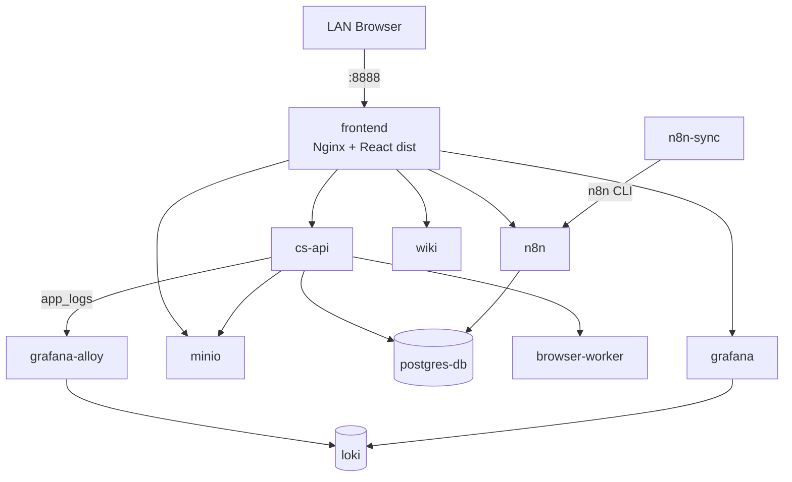
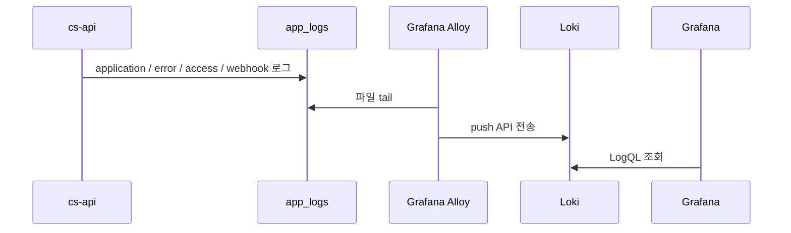

# 배포 아키텍처

현재 시스템은 한 호스트에서 Docker Compose로 실행하는 단일 노드 배포다. 이 문서는 실제 Compose 서비스와 volume 연결을 기준으로 설명한다.

## 컨테이너 구성

`frontend`라는 별도 React 런타임 컨테이너는 없다. `npm run build`가 만든 `apps/frontend/dist`를 `nginx:alpine` 기반 `frontend` 서비스가 `/usr/share/nginx/html`에 마운트해 정적으로 제공한다. 이 Nginx 컨테이너의 이름이 `cs-frontend-nginx`다.

`wiki`는 개발 편의를 위해 `node:24-alpine`에서 소스를 bind mount하고 시작할 때 의존성을 설치한 뒤 Docusaurus 개발 서버를 포트 80으로 실행한다. 고정된 운영 이미지가 필요한 배포에서는 별도 빌드 단계와 immutable image가 필요하다.

## 영속화와 설정 마운트

| 서비스 | 소스 | 컨테이너 경로 | 역할 |
| --- | --- | --- | --- |
| `postgres-db` | `./data/postgres` | `/var/lib/postgresql/data` | DB 데이터 보존 |
| `postgres-db` | `infra/postgres/init-postgres.sql` | `/docker-entrypoint-initdb.d/init-postgres.sql` | 최초 시작 시 `n8n_schema` 생성 |
| `n8n` | `./data/n8n` | `/home/node/.n8n` | n8n 설정과 상태 보존 |
| `minio` | `minio_storage` | `/data` | 첨부 객체 보존 |
| `cs-api` | `app_logs` | `/app/logs` | 애플리케이션·접근·웹훅 로그 기록 |
| `grafana-alloy` | `app_logs` (read-only) | `/app/logs` | 로그 수집 |
| `loki` | `loki_data` | `/loki` | 로그 저장 |
| `grafana` | `grafana_data` | `/var/lib/grafana` | Grafana 상태 보존 |
| `frontend`, `cs-api` | `infra/nginx/.htpasswd` | 각 서비스 설정 경로 | Basic Auth 사용자 원본 공유 |
| `n8n-sync` | Docker socket, 저장소 루트 | `/var/run/docker.sock`, `/app` | 워크플로우 양방향 동기화 |

PostgreSQL과 n8n 데이터는 저장소 아래 bind mount를 사용하고, MinIO·로그·Loki·Grafana는 Docker named volume을 사용한다. 백업 절차를 설계할 때 두 유형을 모두 포함해야 한다.

## 애플리케이션 로그 배포 흐름

대표 로그 경로는 `/app/logs/app/application.log`이며, 오류·접근·웹훅 로그는 각각 별도 하위 경로로 회전 저장된다. Alloy는 `app_logs`를 읽기 전용으로 마운트하므로 애플리케이션 로그를 변경하지 않는다.

## 빌드와 기동 경계

- `cs-api`: `apps/cs-api/Dockerfile`에서 빌드하는 애플리케이션 이미지
- `browser-worker`: Playwright와 Chromium을 포함한 전용 Dockerfile 이미지
- `frontend`: 호스트에서 만들어 둔 `dist`를 Nginx에 mount
- `wiki`: mount한 소스를 컨테이너 시작 시 실행
- PostgreSQL, n8n, MinIO, Loki, Alloy, Grafana: upstream image 사용

따라서 새 checkout에서 `docker compose up`만 실행하기 전에 환경 변수, `.htpasswd`, 프론트엔드 `dist`를 준비해야 한다. 저장소의 실행 절차와 `scripts/verify.sh`를 기준으로 사전 검증한다.
