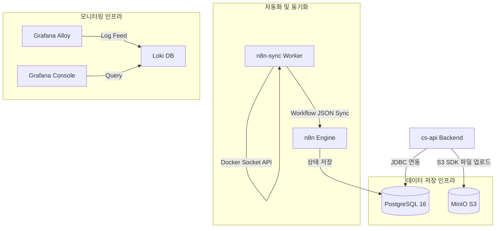

# 인프라 아키텍처 (Infrastructure Architecture)

이 문서는 CS 테스트베드 시스템을 구성하는 주요 인프라 컴포넌트(데이터베이스, 오브젝트 스토리지, 워크플로우 동기화 엔진)의 세부 명세와 컨테이너 간의 내부 유기적 협력 관계를 설명합니다.

---

## 🏗️ 전체 인프라 구성도

시스템의 인프라스트럭처는 Docker Compose 브릿지 네트워크 내에서 서로 격리된 채 전용 스키마, 스토리지 버킷 및 동기화 도구들을 구동합니다.

---

## 💾 1. 데이터베이스 인프라 (PostgreSQL 16)

시스템은 단일 데이터베이스 서버인 `postgres-db` (PostgreSQL 16)를 공동으로 공유하며 스키마를 분리하여 격리합니다.

* **인프라 역할**: 백엔드 시스템(`cs-api`)의 업무용 문의 내역 데이터 저장 및 워크플로우 자동화 도구(`n8n`)의 핵심 엔진 메타데이터 관리를 병행합니다.
* **스키마 분리 전략**:
  * `public` 스키마: 백엔드 `cs-api` 서버가 사용하는 테이블 공간 (예: `customer_inquiry`, `admin_member` 등).
  * `n8n_schema` 스키마: n8n 컨테이너 환경 변수 `DB_POSTGRESDB_SCHEMA=n8n_schema`를 통해 n8n 내부 구동 정보(실행 이력, 노드 상태, 크레덴셜)가 별도 스키마 영역에 적재되도록 격리.
* **자동 초기화**: `./infra/postgres/init-postgres.sql` 파일을 최초 1회 볼륨 마운트하여 데이터베이스 초기 기동 시 데이터 테이블 생성 및 필수 데이터(테스트용 계정 등)를 생성합니다.

---

## 📂 2. 오브젝트 스토리지 인프라 (MinIO)

CS 처리 과정에서 수집된 화면 캡처나 문서 이미지 등을 저장하기 위해 AWS S3 호환 로컬 오브젝트 스토리지인 **MinIO**를 구동합니다.

* **포트 분리**:
  * `9000`: S3 API 통신 전용 포트. `cs-api` 백엔드 서버가 첨부파일 업로드 및 다운로드 시 사용합니다.
  * `9001`: MinIO 웹 관리 콘솔 포트. 어드민이 UI 환경에서 직접 파일 내역을 관리할 수 있는 접근 경로를 제공합니다.
* **초기 자동 버킷 생성 (MinIO Init)**:
  * MinIO 스토리지의 버킷 생성을 수동화하지 않고 `minio-init` 컨테이너 서비스를 추가하여 기동 시 자동화합니다.
  * `minio-init` 서비스는 `minio/mc:latest` 이미지를 활용하여, MinIO API 포트가 준비될 때까지 대기(polling)한 후 `myminio` 별칭을 바인딩하고 환경 변수 `${S3_BUCKET}`에 입력된 버킷 명칭(예: `cs-application`)을 자동으로 생성(`mc mb`)합니다.
  * 생성된 버킷은 비로그인 사용자도 프론트엔드 링크를 통해 이미지를 원활하게 참조할 수 있도록 다운로드 정책(`mc anonymous set download`)을 부여합니다.

---

## 🔄 3. 워크플로우 동기화 인프라 (n8n-sync)

n8n 워크플로우 자동화 프로그램이 개발 코드 및 버전 관리(Git)와 함께 조율되도록 하는 **Node.js 기반 동기화 인프라**입니다.

* **동작 원리**:
  * 호스트 머신의 Docker 소켓(`/var/run/docker.sock`)을 컨테이너 내부에 바인드 마운트하여 기동됩니다.
  * Docker 컨테이너가 켜진 직후, `/infra/n8n/n8n-sync.js` 스크립트를 즉시 실행하여 로컬 디스크 파일 시스템 내의 JSON 워크플로우 리소스(`scratch_workflow.json` 등)를 n8n API 엔드포인트와 대조합니다.
  * 새로 추가되거나 변경된 로컬 워크플로우 파일 상태가 n8n 엔진 내부 데이터베이스에 자동으로 최신화(Import)되므로 개발과 빌드 환경 일치성을 확보합니다.

---

## 📊 4. 모니터링 인프라 (Grafana & Loki & Alloy)

개발 환경 및 운영 환경의 이상 유무 진단을 위해 시각화 인프라를 상시 구동합니다.

*   **Grafana Alloy**: 리소스 효율적인 로그 에이전트. `app_logs` 볼륨을 모니터링하여 로그를 파일 단위로 tailing 한 후 Loki로 전달합니다.
*   **Grafana Provisioning**:
    *   Grafana 대시보드와 데이터 소스를 최초 1회 자동으로 프로비저닝하기 위해 `./infra/grafana/provisioning` 폴더가 읽기 전용으로 연동되어 있어 컨테이너 시작 시 데이터베이스 연동과 대시보드 설정이 완료되어 있습니다.
