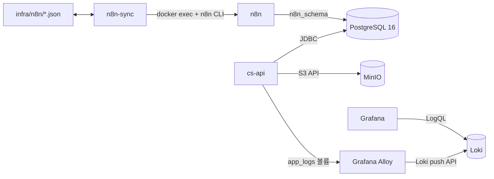

# 인프라 아키텍처

이 문서는 `docker-compose.yml`과 현재 프로비저닝 파일을 기준으로 데이터 저장, 자동화, 로그 관측 구성을 설명한다.

## 전체 구성

모든 서비스는 `n8n_network` 브릿지 네트워크에 참여하고 Compose 서비스 이름으로 통신한다.

## PostgreSQL과 스키마 소유권

단일 `postgres-db` 인스턴스 안에서 두 애플리케이션의 스키마를 분리한다.

| 스키마 | 소유 애플리케이션 | 초기화 주체 |
| --- | --- | --- |
| `public` | `cs-api` | 애플리케이션 시작 시 Flyway migration |
| `n8n_schema` | `n8n` | `init-postgres.sql`이 스키마만 만들고, n8n이 자체 테이블을 관리 |

`infra/postgres/init-postgres.sql`은 `n8n_schema`만 생성한다. 문의, 관리자 계정 등 `cs-api` 업무 테이블과 기준 데이터는 `apps/cs-api/src/main/resources/db/migration`의 Flyway migration이 관리한다. 따라서 초기화 SQL에 업무 테이블을 중복 정의하지 않는다.

데이터 디렉터리 `./data/postgres`는 `/var/lib/postgresql/data`에 bind mount한다. 초기화 스크립트는 빈 데이터 디렉터리에서 PostgreSQL이 처음 시작할 때만 실행된다.

## MinIO

MinIO는 문의 첨부파일용 S3 호환 저장소다.

- `cs-api`는 내부 주소 `http://minio:9000`으로 업로드 URL을 생성한다.
- 호스트의 `9000`은 S3 API, `9001`은 관리 콘솔에 바인딩된다.
- `minio-init`은 MinIO가 준비될 때까지 기다린 뒤 `${S3_BUCKET}` 버킷을 만들고 익명 다운로드 정책을 설정한다.
- 객체 데이터는 `minio_storage` named volume에 보존한다.
- 브라우저 읽기 주소는 Nginx의 `/attachments/` 프록시를 사용한다.

익명 읽기는 현재 첨부파일 표시 요구에 따른 선택이다. 민감 파일을 저장한다면 공개 버킷 대신 인증된 다운로드 또는 만료형 presigned URL로 정책을 변경해야 한다.

## n8n 워크플로우 동기화

`n8n-sync`는 `infra/n8n/n8n-sync.js`를 실행하며 다음 두 워크플로우 JSON을 감시한다.

- `scratch_workflow.json`
- `error_workflow.json`

동기화 컨테이너는 저장소와 `/var/run/docker.sock`을 마운트한다. n8n HTTP API를 호출하는 방식이 아니라 Docker CLI로 `n8n` 컨테이너 안의 `n8n export:workflow`와 `n8n import:workflow` 명령을 실행한다. 로컬 파일과 export 결과를 정규화해 비교하고 `updatedAt`이 더 최신인 쪽을 반영하며, 시각이 같고 내용만 다르면 자동 덮어쓰기를 보류한다.

Docker socket 마운트는 호스트 Docker 제어 권한을 제공하는 강한 권한이다. 이 서비스는 신뢰된 개발 호스트에서만 실행하고 외부 요청을 받지 않도록 유지한다.

## 로그 수집과 조회

`cs-api`는 `app_logs` volume 아래에 다음 로그를 분리해 기록한다.

- `/app/logs/app/application*.log`, `/app/logs/app/error*.log`
- `/app/logs/access/*.log`
- `/app/logs/webhooks/kakao-*.log`, `/app/logs/webhooks/n8n*.log`

Grafana Alloy는 이 volume을 읽기 전용으로 마운트해 파일을 tail하고 `http://loki:3100/loki/api/v1/push`로 전송한다. Loki 데이터는 `loki_data`, Grafana 상태는 `grafana_data` volume에 보존한다.

현재 `infra/grafana/provisioning`은 Loki datasource만 자동 등록한다. 대시보드 JSON은 프로비저닝하지 않으며, Grafana UI에서 만든 대시보드는 `grafana_data`에 저장된다.
