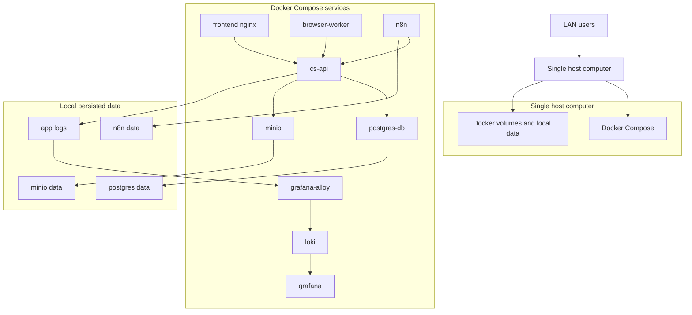
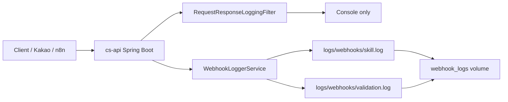
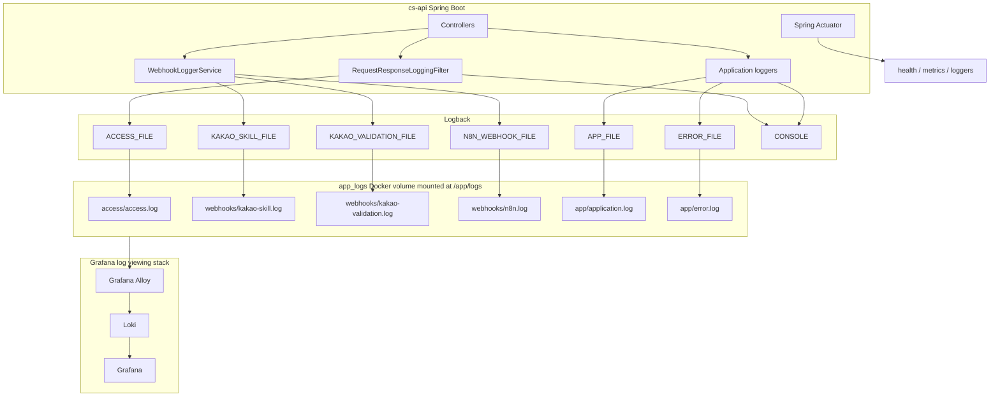
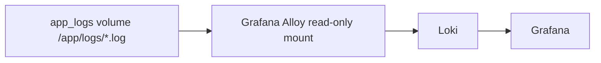

# 로그 및 관측(Observability) 정책

## 배포 전제 조건

이 프로젝트는 하나의 컴퓨터에 Docker Compose로 배포합니다. 서비스는 LAN 내부 IP로만 노출하고, 같은 네트워크를 사용하는 사용자만 접근합니다.

따라서 애플리케이션, DB, 파일 저장소, 로그는 모두 같은 컴퓨터의 Docker volume 또는 bind mount에 저장됩니다.



## 최종 결정 사항

이번 단계에서는 Logback을 유지하고 `logback-spring.xml`을 사용합니다.

결정 사항:

- Spring Boot 기본 logging backend인 Logback 유지
- Log4j2 전환 안 함
- logging YAML 설정 사용 안 함
- OpenTelemetry Collector 추가 안 함
- 로그는 같은 컴퓨터의 Docker named volume에 파일로 저장
- 로그 파일은 JSON line 또는 machine-readable single-line 형태로 저장
- Logback rolling policy로 로컬 보존/삭제 처리
- Actuator는 운영 상태와 metrics 확인에 적극 활용
- Grafana 조회는 `Grafana + Loki + Grafana Alloy`를 Docker Compose에 함께 올려 처리

## Logback의 구현 역할

Logback은 JVM 애플리케이션에서 로그를 실제로 출력하고 저장하는 logging backend입니다. Spring Boot는 기본적으로 SLF4J API 위에 Logback을 붙여 사용합니다.

```text
Application code
  -> SLF4J API
  -> Logback
  -> Console / File / Rolling files
```

Logback이 맡을 일:

- 애플리케이션 내부 로그 라우팅
- access/webhook/app/error 로그 파일 분리
- 파일 rolling
- 짧은 기간의 로컬 로그 보존
- `maxHistory`, `maxFileSize`, `totalSizeCap` 기반 삭제

Logback이 맡지 않을 일:

- 장기 로그 분석 플랫폼
- 대시보드 UI
- 검색 엔진
- Loki/Grafana로 전송하는 수집기 역할

## 이전 로깅 구조



기존 한계:

- 모든 HTTP 요청 metadata는 콘솔로만 출력되었습니다.
- 파일로 저장되는 webhook payload는 `skill`, `validation`뿐이었습니다.
- `/webhooks/n8n` payload는 별도 저장되지 않았습니다.
- Docker volume이 `/app/logs/webhooks`에만 붙어 있어 access/app/error 로그 확장이 어려웠습니다.
- 민감정보 masking, payload size 제한, 보존 정책이 명확하지 않았습니다.

## 개선 목표 로깅 구조



## Docker 볼륨 정책

`webhook_logs`는 `app_logs`로 변경합니다. webhook 전용 볼륨이 아니라 전체 애플리케이션 로그 루트를 보존합니다.

```yaml
volumes:
  app_logs:

services:
  cs-api:
    volumes:
      - app_logs:/app/logs
```

컨테이너 내부 목표 구조:

```text
/app/logs
  access/
    access.log
  webhooks/
    kakao-skill.log
    kakao-validation.log
    n8n.log
  app/
    application.log
    error.log
```

## 로그 카테고리 정의

| Category | Scope | Body 저장 | File | Retention |
| --- | --- | --- | --- | --- |
| Access log | 모든 HTTP 요청 | No | `logs/access/access.log` | 14 days / 50MB each / 1GB total |
| Kakao skill webhook | `/webhooks/kakao/skills` | Yes, masked | `logs/webhooks/kakao-skill.log` | 30 days / 10MB each / 1GB total |
| Kakao validation webhook | `/webhooks/kakao/validation/user-code` | Yes, masked | `logs/webhooks/kakao-validation.log` | 30 days / 10MB each / 1GB total |
| n8n webhook | `/webhooks/n8n` | Yes, masked | `logs/webhooks/n8n.log` | 30 days / 10MB each / 1GB total |
| Application log | 일반 앱 이벤트 | No by default | `logs/app/application.log` | 14 days / 50MB each / 1GB total |
| Error log | WARN/ERROR 이상 | Exception only | `logs/app/error.log` | 30 days / 50MB each / 1GB total |

## Access 로그 정책

모든 HTTP 요청은 metadata만 저장합니다. request body는 절대 읽거나 저장하지 않습니다.

Loki 수집 및 파일 저장을 위해 JSON 형식의 Access log가 `logs/access/access.log`에 기록되며, 동시에 개발 편의성을 위해 콘솔(Standard Output)에는 읽기 쉬운 형태(예: `[HTTP] GET /api/v1/inquiries | Status: 200 | Time: 3ms`)로 포맷팅되어 출력됩니다.

`RequestResponseLoggingFilter`는 다음 필드를 기록합니다.

```text
timestamp
requestId
method
path
query
status
durationMs
clientAddress
userAgent
adminUser
```

logger name:

```text
com.ttam.cs.infra.logging.AccessLogger
```

예시:

```json
{
  "timestamp": "2026-07-05T14:30:00.123+09:00",
  "eventName": "http.server.request",
  "requestId": "0197db2a-75a7-7000-8d20-8cbe3c9ecf21",
  "method": "GET",
  "path": "/api/v1/inquiries",
  "query": "status=pending",
  "status": 200,
  "durationMs": 31,
  "clientAddress": "172.18.0.1",
  "userAgent": "Mozilla/5.0",
  "adminUser": "yoonsik"
}
```

## 웹훅 페이로드(Payload) 정책

request body 저장은 `WebhookLoggerService`에서만 허용합니다. 필터 레벨에서 body를 읽지 않습니다.

저장 허용 endpoint:

```text
/webhooks/kakao/skills
/webhooks/kakao/validation/user-code
/webhooks/n8n
```

저장 금지 endpoint:

```text
/api/v1/auth/**
/api/v1/naver/sessions/**
/api/v1/admin/accounts/**
all other general APIs
```

`WebhookLoggerService`는 provider/type 기반으로 일반화합니다.

```text
provider: kakao | n8n
type: skill | validation | workflow
```

저장 전 처리:

1. `ObjectMapper.valueToTree(payload)`로 JSON tree 변환
2. recursive masking 적용
3. JSON byte size 계산
4. size 제한 이하이면 masked payload 저장
5. size 초과이면 payload는 저장하지 않고 metadata만 저장

## 민감 정보 마스킹(Masking)

아래 key는 대소문자 구분 없이 masking합니다.

```text
authorization
cookie
set-cookie
x-internal-api-token
password
token
accessToken
refreshToken
secret
session
NID_AUT
NID_SES
phone
email
```

저장 값:

```text
***MASKED***
```

## 페이로드 크기 제한

기본 payload log 제한:

```text
64KB
```

초과 시 payload 원문 또는 일부를 저장하지 않습니다. truncate는 JSON 의미를 깨거나 민감정보 일부를 남길 수 있으므로 사용하지 않습니다.

초과 시 저장 예시:

```json
{
  "timestamp": "2026-07-05T14:31:00.123+09:00",
  "eventName": "webhook.request.received",
  "provider": "kakao",
  "type": "skill",
  "payloadStored": false,
  "reason": "payload_too_large",
  "payloadSizeBytes": 182034,
  "maxPayloadSizeBytes": 65536
}
```

정상 저장 예시:

```json
{
  "timestamp": "2026-07-05T14:31:00.123+09:00",
  "eventName": "webhook.request.received",
  "provider": "kakao",
  "type": "skill",
  "payloadStored": true,
  "payload": {
    "userRequest": {
      "user": {
        "properties": {
          "email": "***MASKED***"
        }
      }
    }
  }
}
```

## Spring Actuator 정책

Actuator는 단일 PC 배포에서도 운영 상태 확인에 사용합니다.

노출 권장 endpoint:

```yaml
management:
  endpoints:
    web:
      base-path: /internal/actuator
      exposure:
        include: health,info,metrics,prometheus,loggers
  endpoint:
    health:
      probes:
        enabled: true
      show-details: when-authorized
```

역할:

- `health`: 전체 상태 확인
- `health/liveness`: 프로세스 생존 여부
- `health/readiness`: 트래픽 받을 준비 여부
- `metrics`: JVM, HTTP, HikariCP 등 내부 metric 조회
- `prometheus`: 추후 Prometheus 또는 Grafana Alloy가 scrape 가능
- `loggers`: 운영 중 log level 확인/변경

보안:

- `/internal/actuator/**`는 admin 권한 필요
- LAN 내부 노출이어도 actuator는 일반 사용자에게 공개하지 않습니다.

## Grafana 로그 시각화

이번 구현 범위에는 Grafana, Loki, Grafana Alloy를 포함합니다. Grafana가 파일을 직접 읽지는 않고, Grafana Alloy가 `app_logs` volume의 파일 로그를 tailing해서 Loki로 전송하면 Grafana가 Loki datasource로 조회합니다.

조회 구조:



Promtail은 사용하지 않습니다. Grafana 공식 문서 기준으로 Promtail은 2026-03-02 EOL이며, 신규 구성에서는 Grafana Alloy를 사용하는 쪽이 맞습니다.

Compose 구성:

```text
cs-api
  -> app_logs volume
grafana-alloy
  -> reads app_logs as read-only
  -> sends logs to loki
loki
  -> stores/searches logs
grafana
  -> visualizes logs
```

Grafana 접속:

```text
http://localhost:3001
```

기본 계정은 `.env`의 `GRAFANA_ADMIN_USER`, `GRAFANA_ADMIN_PASSWORD`로 관리합니다.

Loki label 예시:

```text
{service="cs-api", log_type="access"}
{service="cs-api", log_type="webhook"}
{service="cs-api", log_type="webhook", webhook_type="kakao-skill"}
{service="cs-api", log_type="error"}
```

JSON access log 조회 예시:

```text
{service="cs-api", log_type="access"} | json | status >= 500
{service="cs-api", log_type="access"} | json | durationMs > 1000
```

## 범위 외 사항 (제외)

이번 단계에서 하지 않는 것:

- Log4j2 전환
- logging YAML 설정
- OpenTelemetry Collector 추가
- 모든 API request body 저장
- 인증/세션/토큰 관련 body 저장
- 외부 로그 플랫폼 연동

## 구체적 구현 계획

1. `docs/logging-observability-policy.md`를 현재 결정 기준으로 정리
2. `docker-compose.yml`에서 `webhook_logs`를 `app_logs`로 변경
3. `cs-api` volume mount를 `/app/logs` 전체로 변경
4. `logback-spring.xml` appender 재구성
5. `RequestResponseLoggingFilter`를 access metadata logger로 수정
6. `WebhookLoggerService`를 provider/type 기반 payload logger로 일반화
7. webhook payload masking 추가
8. webhook payload size limit 추가
9. `/webhooks/n8n` payload log 추가
10. `application.yml` actuator exposure에 `loggers` 추가
11. health liveness/readiness probe 활성화
12. Loki filesystem config 추가
13. Grafana Alloy file tailing config 추가
14. Grafana Loki datasource provisioning 추가
15. build와 compose config 검증

## 변경 대상 파일 목록

```text
docs/logging-observability-policy.md
docker-compose.yml
backend/src/main/resources/logback-spring.xml
backend/src/main/resources/application.yml
backend/src/main/java/com/ttam/cs/infra/config/RequestResponseLoggingFilter.java
backend/src/main/java/com/ttam/cs/infra/webhooks/logging/WebhookLoggerService.java
backend/src/main/java/com/ttam/cs/infra/webhooks/api/WebhookController.java
infra/loki/loki-config.yml
infra/alloy/config.alloy
infra/grafana/provisioning/datasources/loki.yml
.env.example
```

## 검증 및 기동 방법

```bash
gradle clean build
docker compose config --quiet
docker compose build cs-api
```

실행 후 확인:

```bash
docker compose exec cs-api ls -la /app/logs
docker compose exec cs-api ls -la /app/logs/access
docker compose exec cs-api ls -la /app/logs/webhooks
docker compose exec cs-api ls -la /app/logs/app
```
