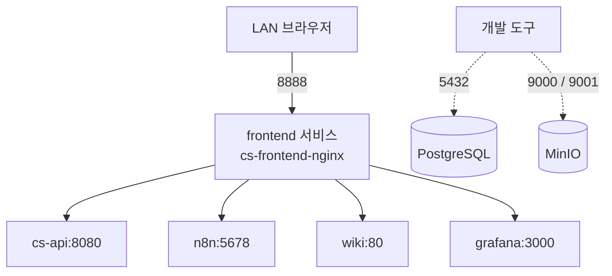

# 네트워크 아키텍처

이 문서는 `docker-compose.yml`과 `infra/nginx/nginx.conf`를 기준으로 컨테이너 통신, 호스트 포트, Nginx 라우팅 경계를 설명한다.

## Docker 브릿지 네트워크

모든 Compose 서비스는 `n8n_network`에 참여한다. 컨테이너는 동적인 IP 대신 서비스 이름을 내부 DNS 이름으로 사용한다.

```text
cs-api          -> postgres-db:5432, minio:9000, browser-worker:3000
n8n             -> postgres-db:5432, cs-api:8080
grafana-alloy   -> loki:3100
frontend/nginx  -> cs-api, n8n, wiki, minio, grafana
```

브릿지 네트워크는 내부 서비스 탐색과 호스트 포트 최소화에 유용하지만, 그 자체가 암호화나 완전한 보안 경계는 아니다. 서비스 토큰, Nginx 인증, 최소 포트 노출을 함께 적용한다.

## 호스트 포트



| 호스트 바인딩 | 용도 | 운영 시 주의 |
| --- | --- | --- |
| `8888:80` | 애플리케이션과 관리 도구의 Nginx 진입점 | LAN allowlist와 인증 적용 |
| `5432:5432` | DBeaver 등 로컬 개발 도구 | 개발 편의 포트이므로 방화벽으로 제한하거나 운영 배포에서 제거 |
| `9000:9000` | MinIO S3 API 테스트 | 외부 공개 금지 권장 |
| `9001:9001` | MinIO 관리 콘솔 직접 접근 | Nginx `/minio/` 경로 사용을 권장하고 직접 포트는 제한 |

`cs-api`, `browser-worker`, `n8n`, `wiki`, `Loki`, `Alloy`, `Grafana`는 호스트 포트를 publish하지 않는다. Compose의 `5432`, `9000`, `9001` 바인딩은 기본적으로 모든 호스트 인터페이스에 열릴 수 있으므로 “외부 포트가 8888 하나뿐”이라고 가정해서는 안 된다.

## Nginx 라우팅

`frontend` Compose 서비스는 React 정적 파일을 제공하는 Nginx이자 내부 서비스의 리버스 프록시다.

| 경로 | 목적지 | 접근 제어 | 역할 |
| --- | --- | --- | --- |
| `/` | Nginx 로컬 `dist` | Basic Auth | React SPA |
| `/api/` | `cs-api:8080` | Basic Auth, `X-Remote-User` 재설정 | 앱 API |
| `/n8n/` | `n8n:5678` | `auth_request` 어드민 쿠키 검증 | 워크플로우 UI |
| `/docs` | `cs-api:8080` | `auth_request` | API 문서 진입점 |
| `/v3/api-docs` | `cs-api:8080` | `auth_request` | OpenAPI JSON |
| `/swagger-ui/` | `cs-api:8080` | `auth_request` | Swagger UI 자산 |
| `/wiki/`, `/ws` | `wiki:80` | `/wiki/`는 `auth_request` | Docusaurus와 개발 WebSocket |
| `/grafana/` | `grafana:3000` | `auth_request` | 로그 조회 UI |
| `/minio/` | `minio:9001` | `auth_request` | MinIO 관리 콘솔 |
| `/attachments/` | `minio:9000` | 인증 없음 | 공개 읽기 첨부파일 |

Nginx는 클라이언트가 보낸 `X-Remote-User` 값을 그대로 신뢰하지 않고 `$remote_user`로 덮어쓴 뒤 `cs-api`로 전달한다.

## LAN allowlist

Nginx는 다음 소스 대역만 허용하고 나머지는 `deny all`로 거부한다.

```nginx
allow 192.168.0.0/16;
allow 10.0.0.0/8;
allow 172.16.0.0/12;
allow 127.0.0.1;
allow ::1;
allow fc00::/7;
deny all;
```

이 정책은 `8888`을 통해 들어오는 요청에 적용된다. PostgreSQL과 MinIO의 직접 host binding에는 Nginx allowlist가 적용되지 않으므로 호스트 방화벽 또는 포트 제거가 별도로 필요하다.
