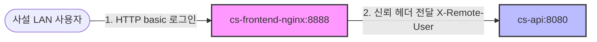
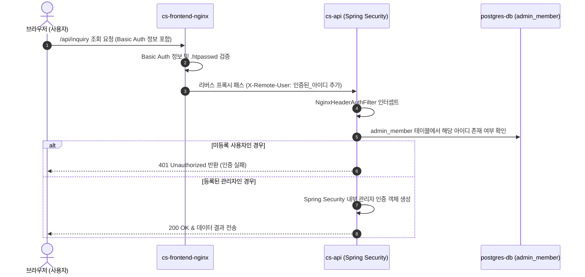
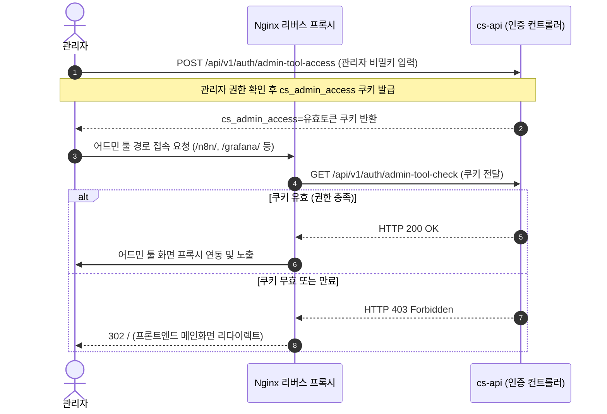
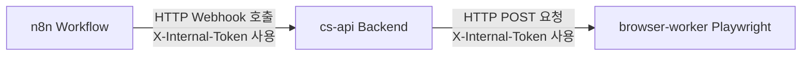

# 보안 및 인증 정책 (Security & Auth Policy)

이 문서는 CS 테스트베드 시스템에 적용된 네트워크 경계 보안 모델, 사용자 API 인증 절차, 어드민 툴 통합 단일인증(SSO-like) 구조 및 시스템 내부 토큰 인증 방침을 정의합니다.

---

## 🛡️ 1. 네트워크 경계 보안 모델

본 서비스는 원칙적으로 **사설망(LAN) 전용 배포**를 전제로 합니다.

* 외부 노출을 수반하는 유일한 관문은 `cs-frontend-nginx` 컨테이너이며, 백엔드 API 및 다른 어드민 모니터링 툴은 포트 바인딩을 차단하여 내부 브릿지 네트워크 영역에 격리합니다.
* 공유 오피스나 다중 접속 사설망 환경의 잠재적 위협을 방어하기 위해 Nginx 수준에서 전체 LAN 접근 허용 필터링과 동시에 **Basic Authentication(기본 로그인 인증)**을 필수 적용합니다.

---

## 🔑 2. 사용자 API 인증 (X-Remote-User)

사용자가 브라우저를 통해 호출하는 일반 비즈니스 API(`/api/**`)의 인증은 Nginx와 Spring Boot 간의 신뢰 협약을 기반으로 동작합니다.

### 📝 인증 시나리오 요약

1. `X-Remote-User` 헤더는 클라이언트(브라우저) 측에서 임의로 조작하거나 변조하여 전송할 수 없습니다. Nginx가 직접 클라이언트의 원본 요청을 덮어쓰고(overwrite) 인증된 사용자명을 주입하여 백엔드로 안전하게 터널링합니다.
2. 백엔드 API 서버는 들어오는 모든 요청에 대해 아래 규칙을 토대로 `NginxHeaderAuthFilter`에서 필터링을 수행합니다:
   * `X-Remote-User` 헤더 없음 + `X-Internal-Token` 헤더 없음 $\rightarrow$ **HTTP 401 Unauthorized**
   * `X-Remote-User` 헤더 존재 + `admin_member` DB 테이블에 미등록된 사용자 $\rightarrow$ **HTTP 401 Unauthorized**
   * `X-Remote-User` 헤더 존재 + `admin_member` DB 테이블에 등록된 사용자 $\rightarrow$ **Spring Security 관리자 인증 컨텍스트 생성**
   * `X-Internal-Token` 헤더 일치 $\rightarrow$ **Spring Security 내부 시스템 인증 컨텍스트 생성 (ROLE_SYSTEM)**

---

## 🎫 3. 어드민 툴 통합 접근 제어 (Cookie-based auth_request)

Nginx를 경유해 노출되는 모니터링 및 개발 어드민 도구들(n8n UI, Grafana, MinIO 콘솔 등)은 별도의 기본 인증(Basic Auth) 창을 다시 요구하지 않는 대신, 백엔드 API 서버의 권한 검증에 통합되어 제어됩니다.

### ⚙️ 검증 세부 명세

* **어드민 툴 경로 지정**: `/n8n/`, `/grafana/`, `/minio/`, `/wiki/` 등.
* **권한 위임 기작**: Nginx 설정의 `auth_request /_admin_tool_auth;` 구문을 통해 사용자가 해당 서비스에 접근을 시도할 때 Nginx가 보이지 않게 백엔드 API인 `/api/v1/auth/admin-tool-check`를 호출합니다.
* **결과 처리**: 백엔드가 HTTP 200을 리턴하면 프록시 연결을 이어나가고, HTTP 403을 리턴하면 어드민 권한이 없는 것으로 간주하여 프론트 로그인 메인화면 `/`로 리다이렉트 처리합니다.

---

## 🔒 4. 내부 서비스 간 통신 보안 (Internal System Auth)

Docker Compose 내부 사설 브릿지 네트워크 내에 있어도 서비스 간의 무단 API 호출이나 데이터 오남용을 예방하기 위해 **Shared Secret (공유 비밀 토큰) 방식**을 활용합니다.

* **토큰 정보**: `.env`에 정의된 `${INTERNAL_API_TOKEN}` 환경변수 값을 활용합니다.
* **browser-worker 보안**: `browser-worker` Express 서버는 들어오는 모든 POST API 요청 헤더의 `x-internal-token`을 검사하는 미들웨어를 내장하고 있습니다. 토큰이 무효하거나 비어 있으면 HTTP 401 Unauthorized를 응답하고 브라우저 제어 명령 수행을 즉시 거부합니다.
* **백엔드 Webhook 보호**: n8n 워크플로우 엔진이 백엔드의 `/webhooks/n8n` 등 전용 웹훅 API 엔드포인트를 호출할 때도 이 토큰을 검증하는 `@RequireInternalAuth` 어노테이션 기반 필터를 구동하여 시스템 간 통신을 암호화 수준으로 보호합니다.
