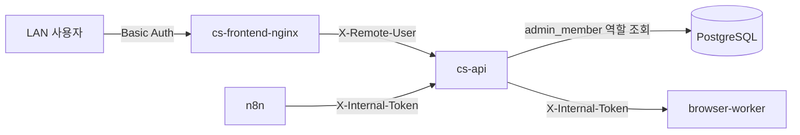
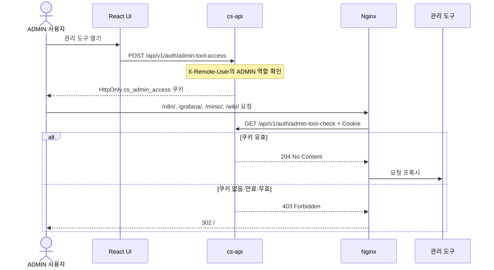

# 보안 정책

현재 보안 모델은 LAN allowlist, Nginx Basic Auth, DB 역할, 관리 도구 쿠키, 내부 서비스 토큰을 서로 다른 경계에 적용한다. 공유 토큰은 요청 주체를 확인하지만 통신 내용을 암호화하지는 않는다.

## 신뢰 경계

Nginx의 `8888` 경로는 LAN allowlist를 적용한 애플리케이션 진입점이다. 다만 개발 편의를 위한 PostgreSQL `5432`와 MinIO `9000/9001` host binding도 존재하므로 호스트 방화벽으로 제한하거나 운영 배포에서 제거해야 한다.

## 사용자 인증과 역할

1. Nginx가 `infra/nginx/.htpasswd`로 Basic Auth를 검증한다.
2. `/api/` 프록시에서 클라이언트의 `X-Remote-User`를 `$remote_user` 값으로 덮어쓴다.
3. `NginxHeaderAuthFilter`가 `admin_member` 테이블에서 사용자를 조회한다.
4. 등록된 역할로 Spring Security 인증 컨텍스트를 만들고 `@RequireRoles`가 기능 권한을 검사한다.

| 요청 상태 | 결과 |
| --- | --- |
| 유효한 `X-Internal-Token` | `ROLE_SYSTEM` 내부 인증 생성 |
| 등록된 `X-Remote-User` | DB 역할 기반 사용자 인증 생성 |
| 사용자 헤더가 없거나 DB에 없음 | `401 Unauthorized` |
| 인증은 됐지만 요구 역할 없음 | `403 Forbidden` |

`X-Remote-User` 신뢰는 `cs-api`가 외부에 직접 publish되지 않고 Nginx가 헤더를 덮어쓴다는 배포 조건에 의존한다. 백엔드 포트를 직접 공개하면 이 가정이 깨진다.

관리자 계정 API는 `admin_member`와 `.htpasswd`를 함께 갱신한다. 파일 쓰기 실패 시 계정 상태가 어긋나지 않도록 관련 코드를 변경할 때 두 저장소의 정합성을 함께 검토해야 한다.

## 관리 도구 접근 쿠키

n8n, Grafana, MinIO 콘솔, Wiki와 API 문서는 Basic Auth를 통과한 것만으로 열리지 않는다. ADMIN 사용자가 발급받은 `cs_admin_access` 쿠키를 Nginx `auth_request`로 검증한다.

이 흐름에는 별도의 “관리자 비밀키” 입력이 없다. 현재 Basic Auth 사용자와 DB의 ADMIN 역할을 확인해 12시간 유효한 HttpOnly, SameSite=Lax 쿠키를 발급한다. 로컬 HTTP 구성을 지원하기 위해 `Secure` 속성은 사용하지 않으므로 HTTPS 배포 시 쿠키 설정도 함께 강화해야 한다.

## 내부 서비스 인증

`.env`의 `INTERNAL_API_TOKEN`을 다음 경계에서 공유한다.

- `cs-api` → `browser-worker`: 일회용 로그인, 댓글 등록, 세션 검증
- `n8n` → `cs-api`: `POST /webhooks/n8n`
- 내부 시스템 → 일부 Naver session API: `@RequireInternalAuth`가 선언된 endpoint

browser-worker는 토큰 누락, 예시 값, 짧은 값으로 시작하지 않으며 요청 토큰을 상수 시간 비교한다. 검증 실패는 브라우저 작업 전에 `401`로 끝난다. 백엔드는 `NginxHeaderAuthFilter`와 `@RequireInternalAuth`로 시스템 요청을 검증한다.

Kakao 웹훅은 `@RequireInternalAuth` 대상이 아니다. 현재 LAN 차단 또는 개발용 public tunnel 경계에 의존하므로 외부 공개 운영 전에는 공급자 서명 검증, 별도 비밀값 또는 게이트웨이 정책을 추가해야 한다.

내부 HTTP 트래픽은 TLS로 암호화되지 않는다. 토큰은 인증·무결성 판단용 비밀값이며 네트워크 암호화를 대신하지 않는다. 다중 호스트나 신뢰할 수 없는 네트워크로 확장할 때는 TLS 또는 서비스 메시 같은 전송 보안이 필요하다.

## 저장 데이터 보호

네이버 세션과 PII는 `infra/security/crypto`의 AES-GCM 변환을 통해 저장 시 암호화한다. 이메일 검색은 평문 저장 대신 별도 HMAC 검색 보조값을 사용한다. `PII_ENCRYPTION_SECRET`과 `NAVER_SESSION_SECRET`은 예시 값을 실제 비밀값으로 교체하고 저장소에 커밋하지 않는다.

첨부파일 버킷은 현재 익명 다운로드 정책이다. 공개 가능한 문의 이미지라는 전제에 맞춘 설정이며, 개인정보나 기밀 문서는 같은 버킷에 저장하지 않아야 한다.
